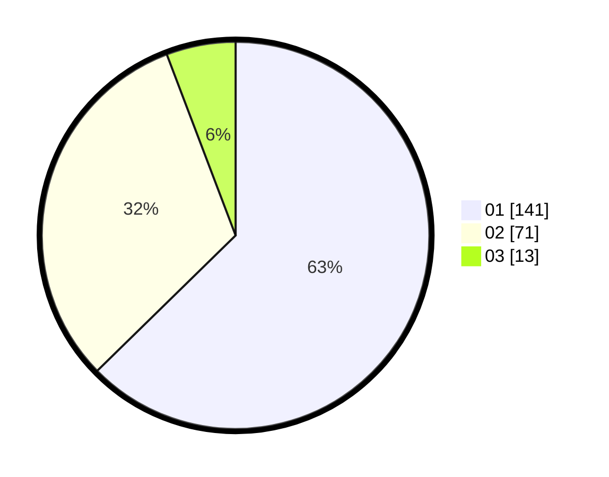

# Hasil

Hasil perolehan suara paslon dapat dilihat pada file paslon-01.txt, paslon-02.txt, dan paslon-03.txt.

Jika tidak ada, artinya data tersebut belum ada pada SIREKAP.

## Perolehan Suara

 * Paslon 01: **141**.
 * Paslon 02: **71**.
 * Paslon 03: **13**.

## Foto C Plano

https://sirekap-obj-formc.kpu.go.id/497b/pemilu/ppwp/31/71/08/10/01/3171081001043-20240216-004541--f662aa21-2a61-41ae-ac4f-037e6a2ac49f.jpg

https://sirekap-obj-formc.kpu.go.id/497b/pemilu/ppwp/31/71/08/10/01/3171081001043-20240216-144611--5eaaa4a8-db7a-4032-909f-36b0d4536c92.jpg

https://sirekap-obj-formc.kpu.go.id/497b/pemilu/ppwp/31/71/08/10/01/3171081001043-20240216-144610--267fe015-7704-495d-b468-c61bf4ce7654.jpg

## DATA PEMILIH TETAP

Jumlah pemilih dalam DPT: **279**.
 * L: **132**.
 * P: **147**.

## DATA PENGGUNA HAK PILIH

Jumlah pengguna hak pilih dalam DPT: **227**.
 * L: **99**.
 * P: **128**.

Jumlah pengguna hak pilih dalam DPTb: **0**.
 * L: **0**.
 * P: **0**.

Jumlah pengguna hak pilih dalam DPK: **1**.
 * L: **0**.
 * P: **1**.

Jumlah pengguna hak pilih: **228**.
 * L: **99**.
 * P: **129**.

## JUMLAH SUARA SAH DAN TIDAK SAH

JUMLAH SELURUH SUARA SAH: **226**.

JUMLAH SUARA TIDAK SAH: **2**.

JUMLAH SELURUH SUARA SAH DAN SUARA TIDAK SAH: **228**.
