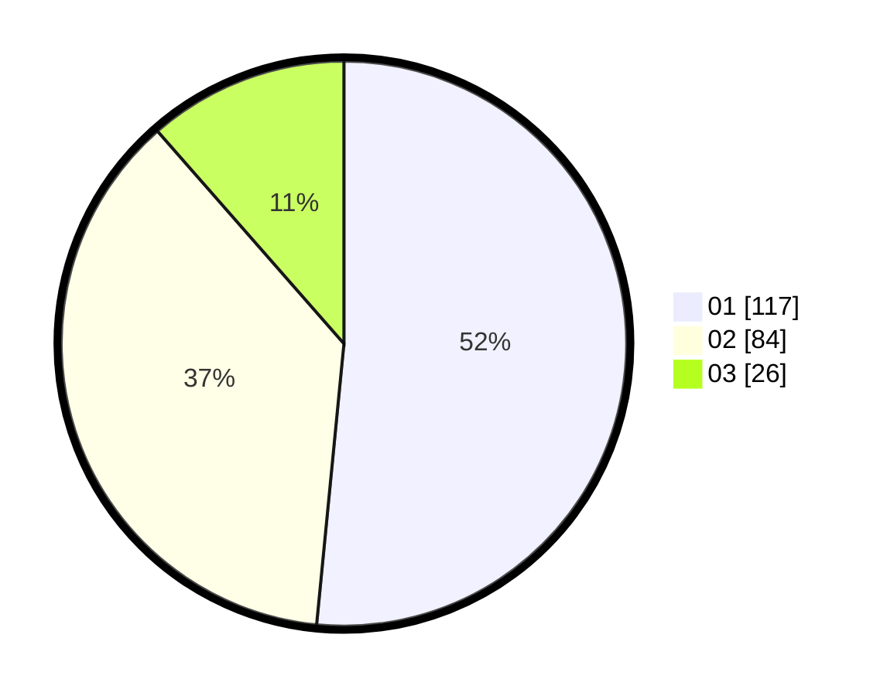

# Hasil

Hasil perolehan suara paslon dapat dilihat pada file paslon-01.txt, paslon-02.txt, dan paslon-03.txt.

Jika tidak ada, artinya data tersebut belum ada pada SIREKAP.

## Perolehan Suara

 * Paslon 01: **117**.
 * Paslon 02: **84**.
 * Paslon 03: **26**.

## Foto C Plano

https://sirekap-obj-formc.kpu.go.id/3090/pemilu/ppwp/31/71/08/10/01/3171081001044-20240216-132845--dc2932c8-5228-4c27-b55d-39af70f78952.jpg

https://sirekap-obj-formc.kpu.go.id/3090/pemilu/ppwp/31/71/08/10/01/3171081001044-20240216-132846--11208c43-d3c2-4f14-a543-5b9370729f37.jpg

https://sirekap-obj-formc.kpu.go.id/3090/pemilu/ppwp/31/71/08/10/01/3171081001044-20240216-132846--0b4d26a9-440b-4e3d-b743-6b6d00888198.jpg

## DATA PEMILIH TETAP

Jumlah pemilih dalam DPT: **278**.
 * L: **131**.
 * P: **147**.

## DATA PENGGUNA HAK PILIH

Jumlah pengguna hak pilih dalam DPT: **227**.
 * L: **102**.
 * P: **125**.

Jumlah pengguna hak pilih dalam DPTb: **4**.
 * L: **1**.
 * P: **3**.

Jumlah pengguna hak pilih dalam DPK: **1**.
 * L: **0**.
 * P: **1**.

Jumlah pengguna hak pilih: **232**.
 * L: **103**.
 * P: **129**.

## JUMLAH SUARA SAH DAN TIDAK SAH

JUMLAH SELURUH SUARA SAH: **227**.

JUMLAH SUARA TIDAK SAH: **5**.

JUMLAH SELURUH SUARA SAH DAN SUARA TIDAK SAH: **232**.
