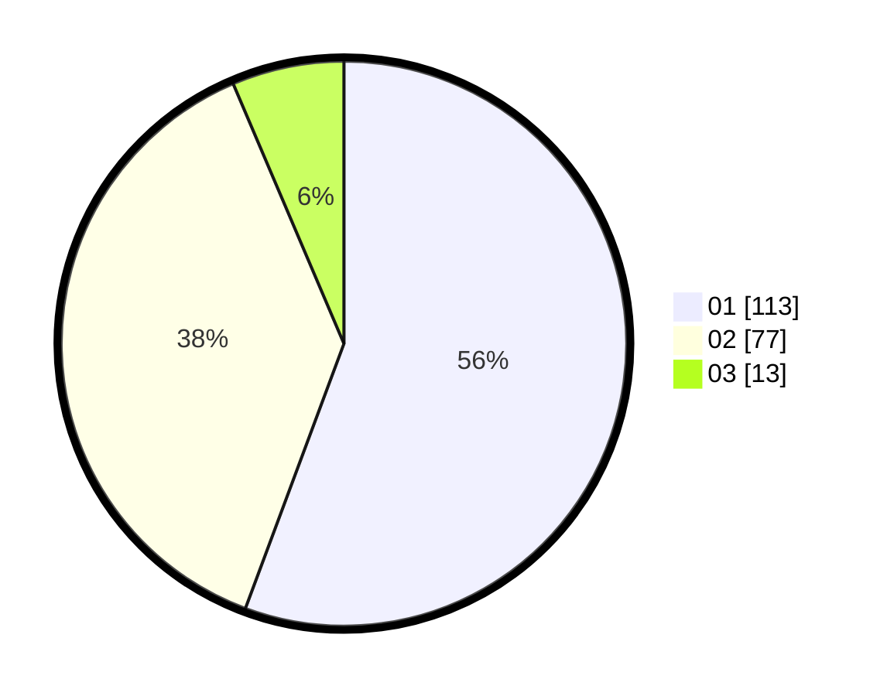

# Hasil

Hasil perolehan suara paslon dapat dilihat pada file paslon-01.txt, paslon-02.txt, dan paslon-03.txt.

Jika tidak ada, artinya data tersebut belum ada pada SIREKAP.

## Perolehan Suara

 * Paslon 01: **113**.
 * Paslon 02: **77**.
 * Paslon 03: **13**.

## Foto C Plano

https://sirekap-obj-formc.kpu.go.id/60c7/pemilu/ppwp/31/71/08/10/01/3171081001048-20240216-130529--b75eae61-1828-46fe-9698-fa347a60a1e9.jpg

https://sirekap-obj-formc.kpu.go.id/60c7/pemilu/ppwp/31/71/08/10/01/3171081001048-20240216-130531--4d8d3fbf-8e67-4e0a-9327-dcfead66c89a.jpg

https://sirekap-obj-formc.kpu.go.id/60c7/pemilu/ppwp/31/71/08/10/01/3171081001048-20240216-130530--b833dc4d-bdfd-41ee-a947-342774c77ce3.jpg

## DATA PEMILIH TETAP

Jumlah pemilih dalam DPT: **243**.
 * L: **113**.
 * P: **130**.

## DATA PENGGUNA HAK PILIH

Jumlah pengguna hak pilih dalam DPT: **199**.
 * L: **91**.
 * P: **108**.

Jumlah pengguna hak pilih dalam DPTb: **7**.
 * L: **2**.
 * P: **5**.

Jumlah pengguna hak pilih dalam DPK: **1**.
 * L: **1**.
 * P: **0**.

Jumlah pengguna hak pilih: **207**.
 * L: **94**.
 * P: **113**.

## JUMLAH SUARA SAH DAN TIDAK SAH

JUMLAH SELURUH SUARA SAH: **203**.

JUMLAH SUARA TIDAK SAH: **4**.

JUMLAH SELURUH SUARA SAH DAN SUARA TIDAK SAH: **207**.
