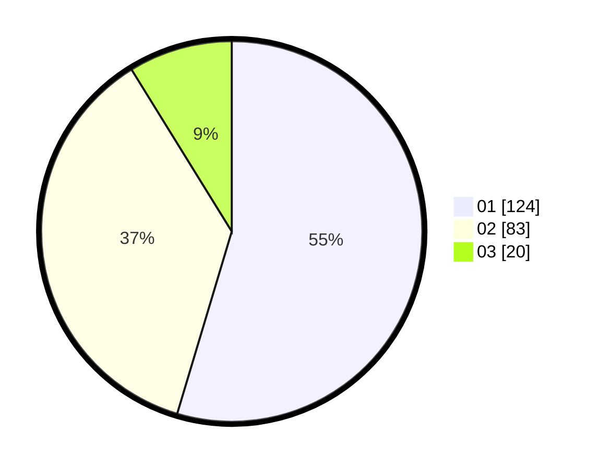

# Hasil

Hasil perolehan suara paslon dapat dilihat pada file paslon-01.txt, paslon-02.txt, dan paslon-03.txt.

Jika tidak ada, artinya data tersebut belum ada pada SIREKAP.

## Perolehan Suara

 * Paslon 01: **124**.
 * Paslon 02: **83**.
 * Paslon 03: **20**.

## Foto C Plano

https://sirekap-obj-formc.kpu.go.id/4b06/pemilu/ppwp/31/71/08/10/01/3171081001050-20240216-131437--578fc9b1-3686-4abd-a0d9-c22167eecdff.jpg

https://sirekap-obj-formc.kpu.go.id/4b06/pemilu/ppwp/31/71/08/10/01/3171081001050-20240216-131438--c8781b8a-a7dd-4be6-a15b-2d89102f445c.jpg

https://sirekap-obj-formc.kpu.go.id/4b06/pemilu/ppwp/31/71/08/10/01/3171081001050-20240216-131438--d255698f-bec5-4738-aff9-1e2cd209bdbc.jpg

## DATA PEMILIH TETAP

Jumlah pemilih dalam DPT: **268**.
 * L: **118**.
 * P: **150**.

## DATA PENGGUNA HAK PILIH

Jumlah pengguna hak pilih dalam DPT: **219**.
 * L: **96**.
 * P: **123**.

Jumlah pengguna hak pilih dalam DPTb: **11**.
 * L: **4**.
 * P: **7**.

Jumlah pengguna hak pilih dalam DPK: **3**.
 * L: **1**.
 * P: **2**.

Jumlah pengguna hak pilih: **233**.
 * L: **101**.
 * P: **132**.

## JUMLAH SUARA SAH DAN TIDAK SAH

JUMLAH SELURUH SUARA SAH: **227**.

JUMLAH SUARA TIDAK SAH: **6**.

JUMLAH SELURUH SUARA SAH DAN SUARA TIDAK SAH: **233**.
