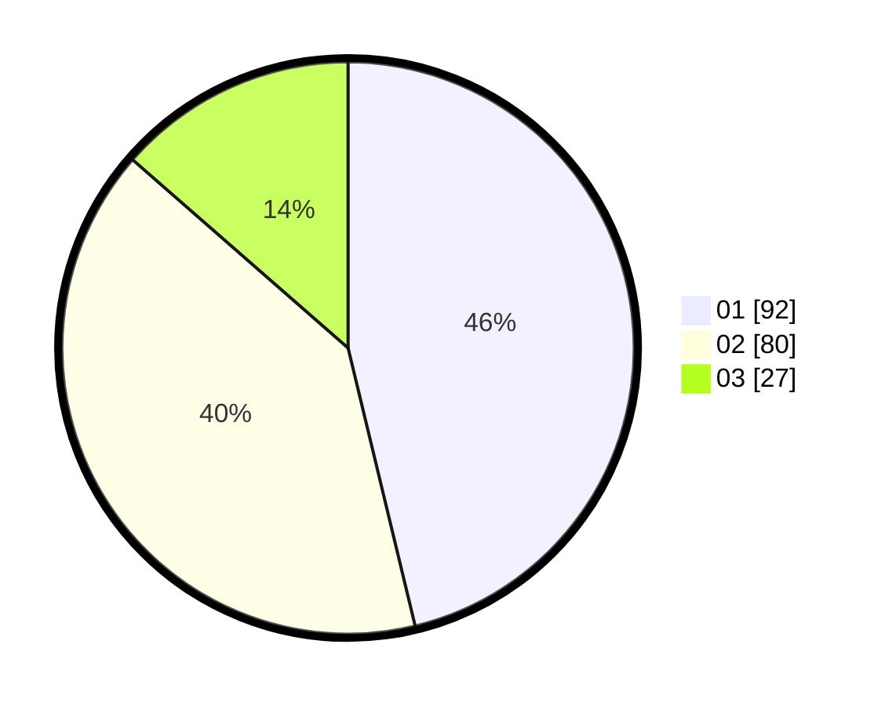

# Hasil

Hasil perolehan suara paslon dapat dilihat pada file paslon-01.txt, paslon-02.txt, dan paslon-03.txt.

Jika tidak ada, artinya data tersebut belum ada pada SIREKAP.

## Perolehan Suara

 * Paslon 01: **92**.
 * Paslon 02: **80**.
 * Paslon 03: **27**.

## Foto C Plano

https://sirekap-obj-formc.kpu.go.id/6040/pemilu/ppwp/31/71/08/10/01/3171081001051-20240214-155208--a2ff6278-6f86-485a-9ab1-f5ca17fd71d1.jpg

https://sirekap-obj-formc.kpu.go.id/6040/pemilu/ppwp/31/71/08/10/01/3171081001051-20240214-155211--5605e3c1-7a5e-4dd2-a32a-c98df5c40efa.jpg

https://sirekap-obj-formc.kpu.go.id/6040/pemilu/ppwp/31/71/08/10/01/3171081001051-20240214-155213--9e466d1a-36fa-4472-9610-679cb1e344fe.jpg

## DATA PEMILIH TETAP

Jumlah pemilih dalam DPT: **255**.
 * L: **126**.
 * P: **129**.

## DATA PENGGUNA HAK PILIH

Jumlah pengguna hak pilih dalam DPT: **189**.
 * L: **91**.
 * P: **98**.

Jumlah pengguna hak pilih dalam DPTb: **12**.
 * L: **7**.
 * P: **5**.

Jumlah pengguna hak pilih dalam DPK: **4**.
 * L: **1**.
 * P: **3**.

Jumlah pengguna hak pilih: **205**.
 * L: **99**.
 * P: **106**.

## JUMLAH SUARA SAH DAN TIDAK SAH

JUMLAH SELURUH SUARA SAH: **199**.

JUMLAH SUARA TIDAK SAH: **6**.

JUMLAH SELURUH SUARA SAH DAN SUARA TIDAK SAH: **205**.
