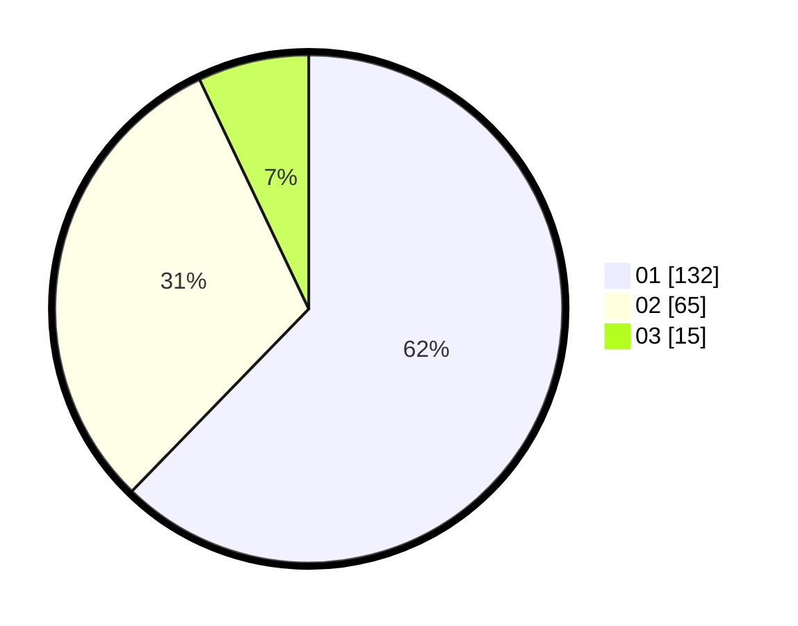

# Hasil

Hasil perolehan suara paslon dapat dilihat pada file paslon-01.txt, paslon-02.txt, dan paslon-03.txt.

Jika tidak ada, artinya data tersebut belum ada pada SIREKAP.

## Perolehan Suara

 * Paslon 01: **132**.
 * Paslon 02: **65**.
 * Paslon 03: **15**.

## Foto C Plano

https://sirekap-obj-formc.kpu.go.id/6351/pemilu/ppwp/31/71/08/10/01/3171081001054-20240214-202512--42915c92-dcce-47ba-8c42-796559d0212d.jpg

https://sirekap-obj-formc.kpu.go.id/6351/pemilu/ppwp/31/71/08/10/01/3171081001054-20240214-202528--09eb07e2-8586-4b73-925d-91f9d5d03cb8.jpg

https://sirekap-obj-formc.kpu.go.id/6351/pemilu/ppwp/31/71/08/10/01/3171081001054-20240214-202706--6e1cbdf7-4ccb-42be-9bd1-09b105822b17.jpg

## DATA PEMILIH TETAP

Jumlah pemilih dalam DPT: **253**.
 * L: **116**.
 * P: **137**.

## DATA PENGGUNA HAK PILIH

Jumlah pengguna hak pilih dalam DPT: **213**.
 * L: **91**.
 * P: **122**.

Jumlah pengguna hak pilih dalam DPTb: **0**.
 * L: **0**.
 * P: **0**.

Jumlah pengguna hak pilih dalam DPK: **2**.
 * L: **1**.
 * P: **1**.

Jumlah pengguna hak pilih: **215**.
 * L: **92**.
 * P: **123**.

## JUMLAH SUARA SAH DAN TIDAK SAH

JUMLAH SELURUH SUARA SAH: **212**.

JUMLAH SUARA TIDAK SAH: **3**.

JUMLAH SELURUH SUARA SAH DAN SUARA TIDAK SAH: **215**.
