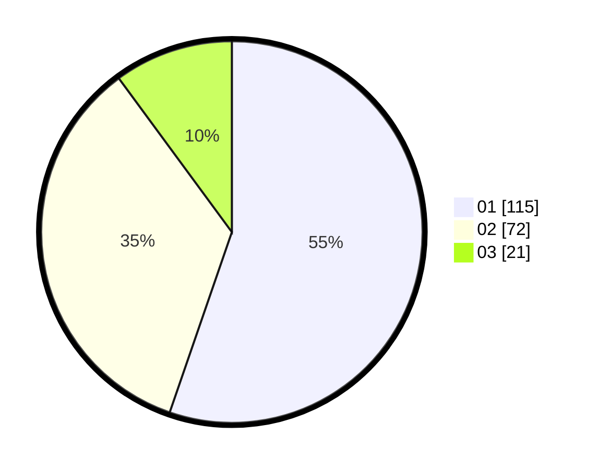

# Hasil

Hasil perolehan suara paslon dapat dilihat pada file paslon-01.txt, paslon-02.txt, dan paslon-03.txt.

Jika tidak ada, artinya data tersebut belum ada pada SIREKAP.

## Perolehan Suara

 * Paslon 01: **115**.
 * Paslon 02: **72**.
 * Paslon 03: **21**.

## Foto C Plano

https://sirekap-obj-formc.kpu.go.id/a510/pemilu/ppwp/31/71/08/10/01/3171081001056-20240214-160133--933737ab-e53c-4e02-9bf2-2344eea628b3.jpg

https://sirekap-obj-formc.kpu.go.id/a510/pemilu/ppwp/31/71/08/10/01/3171081001056-20240214-160126--cd62cb4d-8d5e-48b4-8fe0-2fccba0cf599.jpg

https://sirekap-obj-formc.kpu.go.id/a510/pemilu/ppwp/31/71/08/10/01/3171081001056-20240214-160119--b22f81e5-92a5-4f2d-b0fc-f91e741a251b.jpg

## DATA PEMILIH TETAP

Jumlah pemilih dalam DPT: **209**.
 * L: **91**.
 * P: **118**.

## DATA PENGGUNA HAK PILIH

Jumlah pengguna hak pilih dalam DPT: **201**.
 * L: **89**.
 * P: **112**.

Jumlah pengguna hak pilih dalam DPTb: **8**.
 * L: **2**.
 * P: **6**.

Jumlah pengguna hak pilih dalam DPK: **0**.
 * L: **0**.
 * P: **0**.

Jumlah pengguna hak pilih: **209**.
 * L: **91**.
 * P: **118**.

## JUMLAH SUARA SAH DAN TIDAK SAH

JUMLAH SELURUH SUARA SAH: **208**.

JUMLAH SUARA TIDAK SAH: **1**.

JUMLAH SELURUH SUARA SAH DAN SUARA TIDAK SAH: **209**.
