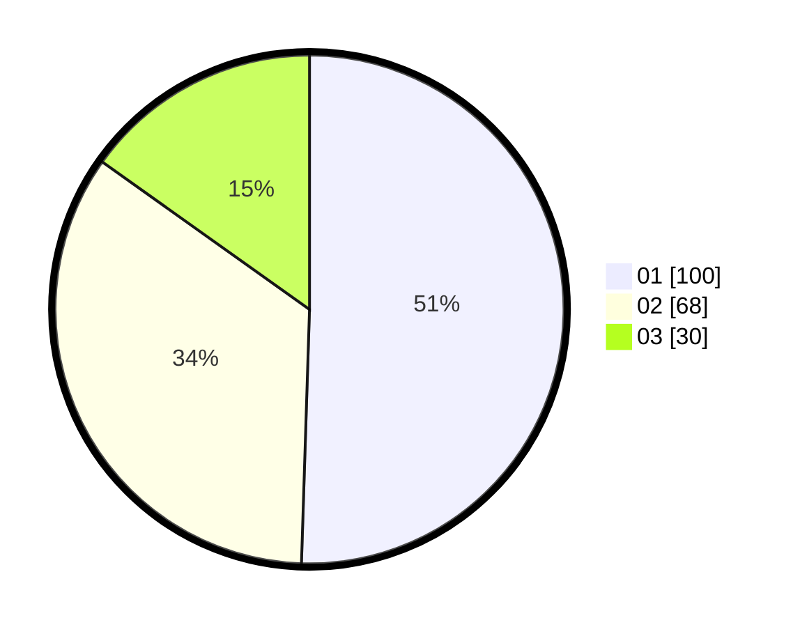

# Hasil

Hasil perolehan suara paslon dapat dilihat pada file paslon-01.txt, paslon-02.txt, dan paslon-03.txt.

Jika tidak ada, artinya data tersebut belum ada pada SIREKAP.

## Perolehan Suara

 * Paslon 01: **100**.
 * Paslon 02: **68**.
 * Paslon 03: **30**.

## Foto C Plano

https://sirekap-obj-formc.kpu.go.id/be1d/pemilu/ppwp/31/71/08/10/01/3171081001057-20240216-145513--3e1cae69-8e6a-4533-9f71-32291c63ceab.jpg

https://sirekap-obj-formc.kpu.go.id/be1d/pemilu/ppwp/31/71/08/10/01/3171081001057-20240216-145515--f56821d0-b7aa-4d3f-9e9e-ff4d629abfe1.jpg

https://sirekap-obj-formc.kpu.go.id/be1d/pemilu/ppwp/31/71/08/10/01/3171081001057-20240216-145514--11124698-1312-462c-b69f-dfb176d58498.jpg

## DATA PEMILIH TETAP

Jumlah pemilih dalam DPT: **242**.
 * L: **115**.
 * P: **127**.

## DATA PENGGUNA HAK PILIH

Jumlah pengguna hak pilih dalam DPT: **195**.
 * L: **89**.
 * P: **106**.

Jumlah pengguna hak pilih dalam DPTb: **3**.
 * L: **1**.
 * P: **2**.

Jumlah pengguna hak pilih dalam DPK: **3**.
 * L: **1**.
 * P: **2**.

Jumlah pengguna hak pilih: **201**.
 * L: **91**.
 * P: **110**.

## JUMLAH SUARA SAH DAN TIDAK SAH

JUMLAH SELURUH SUARA SAH: **198**.

JUMLAH SUARA TIDAK SAH: **3**.

JUMLAH SELURUH SUARA SAH DAN SUARA TIDAK SAH: **201**.
