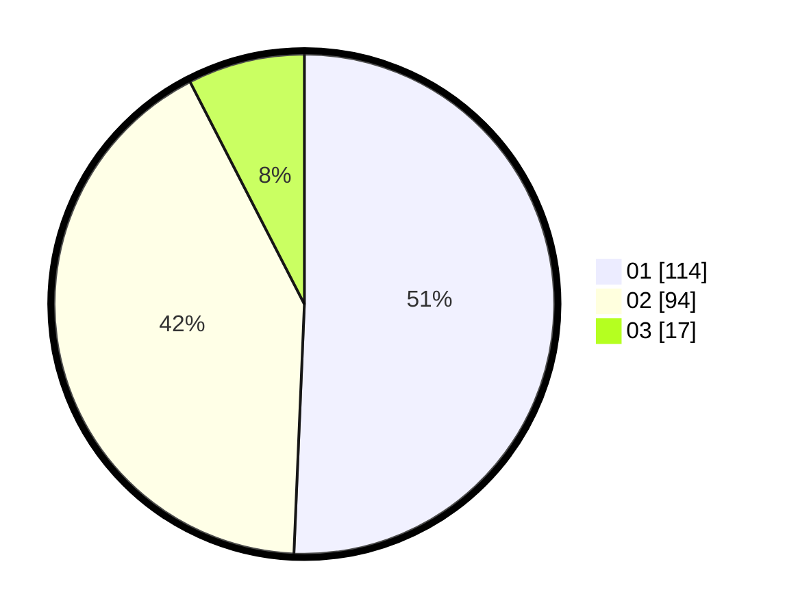

# Hasil

Hasil perolehan suara paslon dapat dilihat pada file paslon-01.txt, paslon-02.txt, dan paslon-03.txt.

Jika tidak ada, artinya data tersebut belum ada pada SIREKAP.

## Perolehan Suara

 * Paslon 01: **114**.
 * Paslon 02: **94**.
 * Paslon 03: **17**.

## Foto C Plano

https://sirekap-obj-formc.kpu.go.id/9d98/pemilu/ppwp/31/71/08/10/01/3171081001058-20240216-194400--4e2fb613-b385-451f-b0e7-9e6a4ace934b.jpg

https://sirekap-obj-formc.kpu.go.id/9d98/pemilu/ppwp/31/71/08/10/01/3171081001058-20240216-194401--f675c206-f672-493a-93f6-be41028b031e.jpg

https://sirekap-obj-formc.kpu.go.id/9d98/pemilu/ppwp/31/71/08/10/01/3171081001058-20240216-194400--7e0c42a6-a4b2-4c7a-83af-e5bfc2f684b6.jpg

## DATA PEMILIH TETAP

Jumlah pemilih dalam DPT: **254**.
 * L: **122**.
 * P: **132**.

## DATA PENGGUNA HAK PILIH

Jumlah pengguna hak pilih dalam DPT: **205**.
 * L: **96**.
 * P: **109**.

Jumlah pengguna hak pilih dalam DPTb: **5**.
 * L: **5**.
 * P: **0**.

Jumlah pengguna hak pilih dalam DPK: **15**.
 * L: **6**.
 * P: **9**.

Jumlah pengguna hak pilih: **225**.
 * L: **107**.
 * P: **118**.

## JUMLAH SUARA SAH DAN TIDAK SAH

JUMLAH SELURUH SUARA SAH: **225**.

JUMLAH SUARA TIDAK SAH: **1**.

JUMLAH SELURUH SUARA SAH DAN SUARA TIDAK SAH: **226**.
