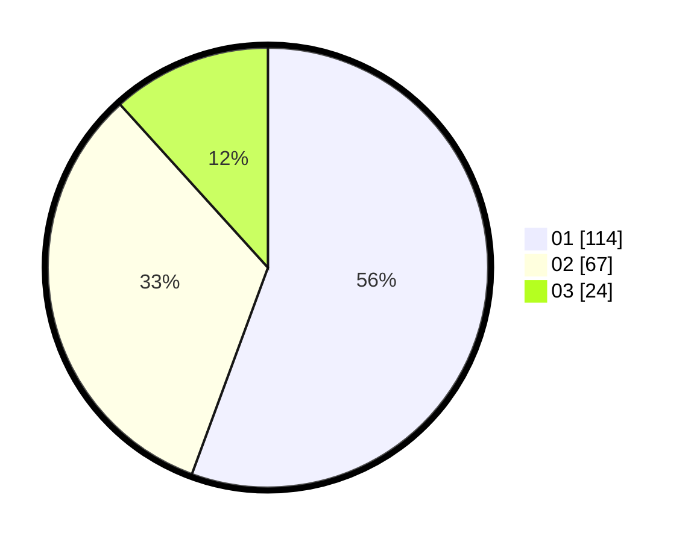

# Hasil

Hasil perolehan suara paslon dapat dilihat pada file paslon-01.txt, paslon-02.txt, dan paslon-03.txt.

Jika tidak ada, artinya data tersebut belum ada pada SIREKAP.

## Perolehan Suara

 * Paslon 01: **114**.
 * Paslon 02: **67**.
 * Paslon 03: **24**.

## Foto C Plano

https://sirekap-obj-formc.kpu.go.id/8634/pemilu/ppwp/31/71/08/10/01/3171081001059-20240216-145346--271d34f9-dbcc-4fad-9dc7-84473ef15ff0.jpg

https://sirekap-obj-formc.kpu.go.id/8634/pemilu/ppwp/31/71/08/10/01/3171081001059-20240216-145347--e14b8d67-8829-441f-a06e-683c78c75163.jpg

https://sirekap-obj-formc.kpu.go.id/8634/pemilu/ppwp/31/71/08/10/01/3171081001059-20240216-145347--a98384f9-f29f-4862-bacb-68633253bba1.jpg

## DATA PEMILIH TETAP

Jumlah pemilih dalam DPT: **249**.
 * L: **117**.
 * P: **132**.

## DATA PENGGUNA HAK PILIH

Jumlah pengguna hak pilih dalam DPT: **200**.
 * L: **87**.
 * P: **113**.

Jumlah pengguna hak pilih dalam DPTb: **6**.
 * L: **2**.
 * P: **4**.

Jumlah pengguna hak pilih dalam DPK: **5**.
 * L: **2**.
 * P: **3**.

Jumlah pengguna hak pilih: **211**.
 * L: **91**.
 * P: **120**.

## JUMLAH SUARA SAH DAN TIDAK SAH

JUMLAH SELURUH SUARA SAH: **205**.

JUMLAH SUARA TIDAK SAH: **6**.

JUMLAH SELURUH SUARA SAH DAN SUARA TIDAK SAH: **211**.
