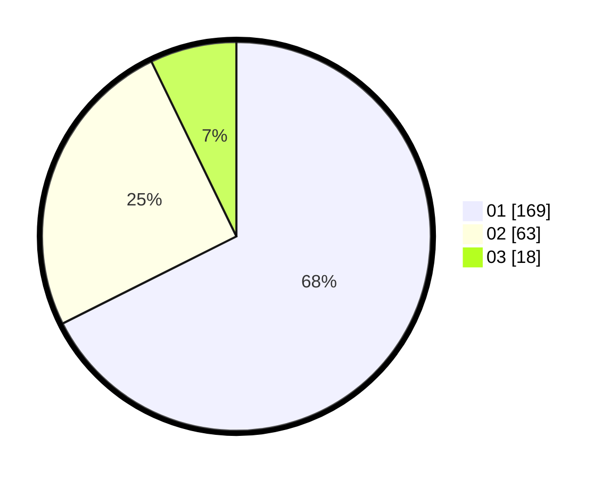

# Hasil

Hasil perolehan suara paslon dapat dilihat pada file paslon-01.txt, paslon-02.txt, dan paslon-03.txt.

Jika tidak ada, artinya data tersebut belum ada pada SIREKAP.

## Perolehan Suara

 * Paslon 01: **169**.
 * Paslon 02: **63**.
 * Paslon 03: **18**.

## Foto C Plano

https://sirekap-obj-formc.kpu.go.id/ecb8/pemilu/ppwp/31/71/08/10/01/3171081001060-20240216-144558--02ad2efa-5b50-4643-b885-c1334b268151.jpg

https://sirekap-obj-formc.kpu.go.id/ecb8/pemilu/ppwp/31/71/08/10/01/3171081001060-20240216-144600--66031c21-0aee-4c5f-a35d-d31f88bf7cbb.jpg

https://sirekap-obj-formc.kpu.go.id/ecb8/pemilu/ppwp/31/71/08/10/01/3171081001060-20240216-144559--78fa7fde-f8e2-4eca-93f9-66c2f148c01b.jpg

## DATA PEMILIH TETAP

Jumlah pemilih dalam DPT: **283**.
 * L: **123**.
 * P: **160**.

## DATA PENGGUNA HAK PILIH

Jumlah pengguna hak pilih dalam DPT: **245**.
 * L: **103**.
 * P: **142**.

Jumlah pengguna hak pilih dalam DPTb: **3**.
 * L: **1**.
 * P: **2**.

Jumlah pengguna hak pilih dalam DPK: **2**.
 * L: **2**.
 * P: **0**.

Jumlah pengguna hak pilih: **250**.
 * L: **106**.
 * P: **144**.

## JUMLAH SUARA SAH DAN TIDAK SAH

JUMLAH SELURUH SUARA SAH: **250**.

JUMLAH SUARA TIDAK SAH: **1**.

JUMLAH SELURUH SUARA SAH DAN SUARA TIDAK SAH: **251**.
