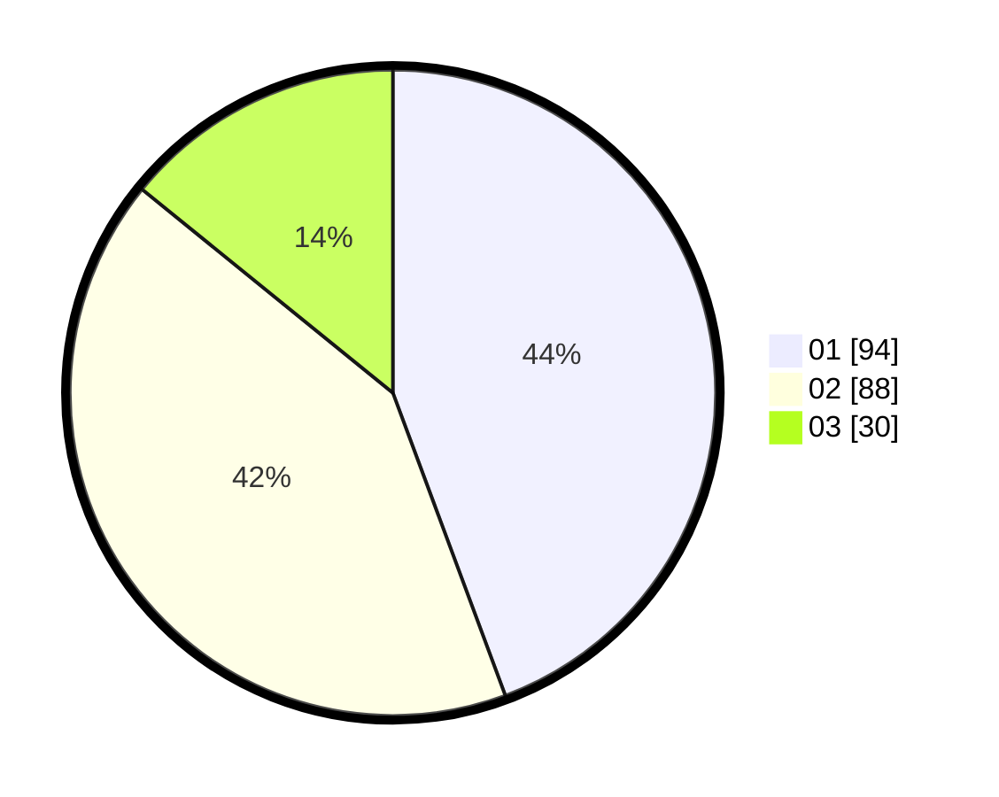

# Hasil

Hasil perolehan suara paslon dapat dilihat pada file paslon-01.txt, paslon-02.txt, dan paslon-03.txt.

Jika tidak ada, artinya data tersebut belum ada pada SIREKAP.

## Perolehan Suara

 * Paslon 01: **94**.
 * Paslon 02: **88**.
 * Paslon 03: **30**.

## Foto C Plano

https://sirekap-obj-formc.kpu.go.id/6044/pemilu/ppwp/31/71/08/10/01/3171081001062-20240216-052544--31cbc5c2-73fc-43d4-8203-16e0a8683d73.jpg

https://sirekap-obj-formc.kpu.go.id/6044/pemilu/ppwp/31/71/08/10/01/3171081001062-20240216-113737--dd7efb78-3b86-45c3-8ca9-8f912b7af16c.jpg

https://sirekap-obj-formc.kpu.go.id/6044/pemilu/ppwp/31/71/08/10/01/3171081001062-20240216-052548--24c72260-4c84-4b8c-be19-088583ea9bb4.jpg

## DATA PEMILIH TETAP

Jumlah pemilih dalam DPT: **284**.
 * L: **136**.
 * P: **148**.

## DATA PENGGUNA HAK PILIH

Jumlah pengguna hak pilih dalam DPT: **216**.
 * L: **97**.
 * P: **119**.

Jumlah pengguna hak pilih dalam DPTb: **0**.
 * L: **0**.
 * P: **0**.

Jumlah pengguna hak pilih dalam DPK: **0**.
 * L: **0**.
 * P: **0**.

Jumlah pengguna hak pilih: **216**.
 * L: **97**.
 * P: **119**.

## JUMLAH SUARA SAH DAN TIDAK SAH

JUMLAH SELURUH SUARA SAH: **212**.

JUMLAH SUARA TIDAK SAH: **4**.

JUMLAH SELURUH SUARA SAH DAN SUARA TIDAK SAH: **216**.
