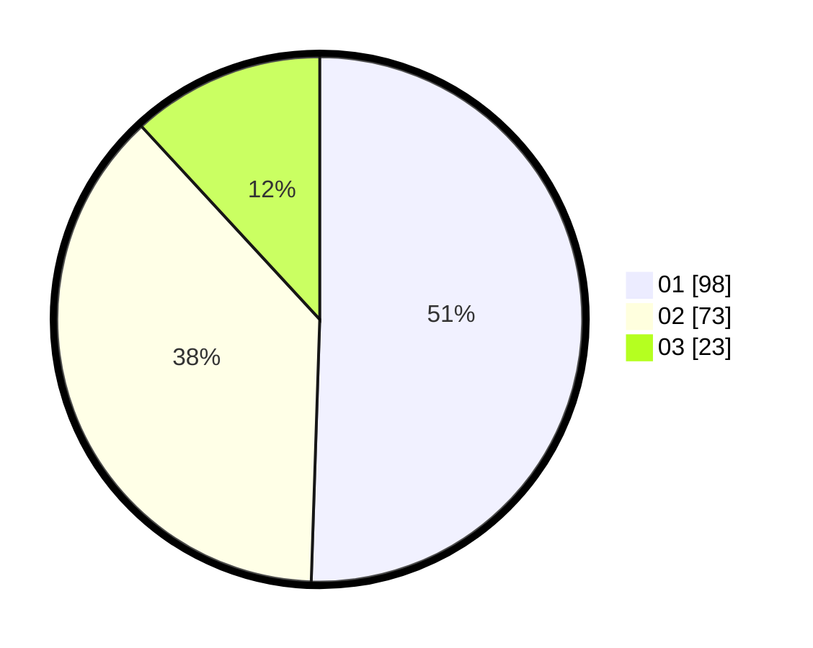

# Hasil

Hasil perolehan suara paslon dapat dilihat pada file paslon-01.txt, paslon-02.txt, dan paslon-03.txt.

Jika tidak ada, artinya data tersebut belum ada pada SIREKAP.

## Perolehan Suara

 * Paslon 01: **98**.
 * Paslon 02: **73**.
 * Paslon 03: **23**.

## Foto C Plano

https://sirekap-obj-formc.kpu.go.id/458e/pemilu/ppwp/31/71/08/10/01/3171081001069-20240216-144949--15cd2662-23b8-4507-b3ac-049809b927c2.jpg

https://sirekap-obj-formc.kpu.go.id/458e/pemilu/ppwp/31/71/08/10/01/3171081001069-20240216-144950--67136306-e1b2-499a-bc42-717f3f8e325f.jpg

https://sirekap-obj-formc.kpu.go.id/458e/pemilu/ppwp/31/71/08/10/01/3171081001069-20240216-144949--e6d1cbc6-9a4f-4691-929e-87c5de8f1545.jpg

## DATA PEMILIH TETAP

Jumlah pemilih dalam DPT: **232**.
 * L: **114**.
 * P: **118**.

## DATA PENGGUNA HAK PILIH

Jumlah pengguna hak pilih dalam DPT: **193**.
 * L: **93**.
 * P: **100**.

Jumlah pengguna hak pilih dalam DPTb: **2**.
 * L: **0**.
 * P: **2**.

Jumlah pengguna hak pilih dalam DPK: **4**.
 * L: **3**.
 * P: **1**.

Jumlah pengguna hak pilih: **199**.
 * L: **96**.
 * P: **103**.

## JUMLAH SUARA SAH DAN TIDAK SAH

JUMLAH SELURUH SUARA SAH: **194**.

JUMLAH SUARA TIDAK SAH: **5**.

JUMLAH SELURUH SUARA SAH DAN SUARA TIDAK SAH: **199**.
