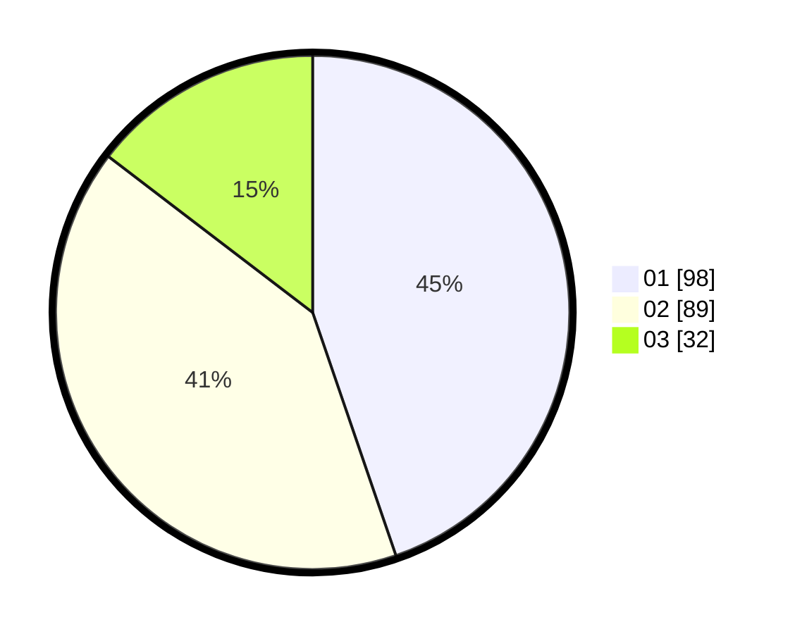

# Hasil

Hasil perolehan suara paslon dapat dilihat pada file paslon-01.txt, paslon-02.txt, dan paslon-03.txt.

Jika tidak ada, artinya data tersebut belum ada pada SIREKAP.

## Perolehan Suara

 * Paslon 01: **98**.
 * Paslon 02: **89**.
 * Paslon 03: **32**.

## Foto C Plano

https://sirekap-obj-formc.kpu.go.id/9b5d/pemilu/ppwp/31/71/08/10/01/3171081001070-20240216-150418--268a3ef7-3093-405d-8c7d-3d2b8c9d6d7f.jpg

https://sirekap-obj-formc.kpu.go.id/9b5d/pemilu/ppwp/31/71/08/10/01/3171081001070-20240216-150419--dcd87c82-3307-4c05-b284-7e3210876809.jpg

https://sirekap-obj-formc.kpu.go.id/9b5d/pemilu/ppwp/31/71/08/10/01/3171081001070-20240216-150418--cc420ae3-4b6f-4ec6-a938-73e05971c190.jpg

## DATA PEMILIH TETAP

Jumlah pemilih dalam DPT: **265**.
 * L: **128**.
 * P: **137**.

## DATA PENGGUNA HAK PILIH

Jumlah pengguna hak pilih dalam DPT: **209**.
 * L: **94**.
 * P: **115**.

Jumlah pengguna hak pilih dalam DPTb: **14**.
 * L: **7**.
 * P: **7**.

Jumlah pengguna hak pilih dalam DPK: **1**.
 * L: **0**.
 * P: **1**.

Jumlah pengguna hak pilih: **224**.
 * L: **101**.
 * P: **123**.

## JUMLAH SUARA SAH DAN TIDAK SAH

JUMLAH SELURUH SUARA SAH: **219**.

JUMLAH SUARA TIDAK SAH: **5**.

JUMLAH SELURUH SUARA SAH DAN SUARA TIDAK SAH: **224**.
