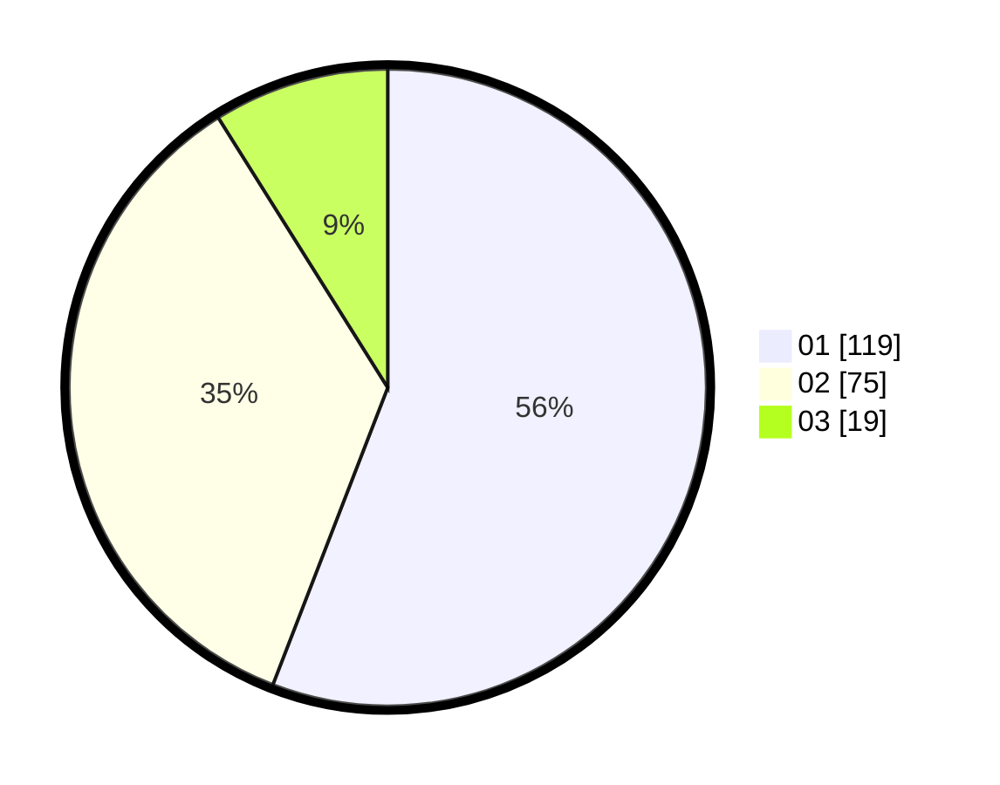

# Hasil

Hasil perolehan suara paslon dapat dilihat pada file paslon-01.txt, paslon-02.txt, dan paslon-03.txt.

Jika tidak ada, artinya data tersebut belum ada pada SIREKAP.

## Perolehan Suara

 * Paslon 01: **119**.
 * Paslon 02: **75**.
 * Paslon 03: **19**.

## Foto C Plano

https://sirekap-obj-formc.kpu.go.id/f60b/pemilu/ppwp/31/71/08/10/01/3171081001071-20240216-162241--0b817c32-b2b2-4796-96c4-cd1998d522de.jpg

https://sirekap-obj-formc.kpu.go.id/f60b/pemilu/ppwp/31/71/08/10/01/3171081001071-20240216-162242--52488a16-544b-4de8-81f4-5cf1b4961b25.jpg

https://sirekap-obj-formc.kpu.go.id/f60b/pemilu/ppwp/31/71/08/10/01/3171081001071-20240216-162242--1a677a1e-3c8a-41b1-99fd-44b300b0fe10.jpg

## DATA PEMILIH TETAP

Jumlah pemilih dalam DPT: **265**.
 * L: **134**.
 * P: **131**.

## DATA PENGGUNA HAK PILIH

Jumlah pengguna hak pilih dalam DPT: **213**.
 * L: **106**.
 * P: **107**.

Jumlah pengguna hak pilih dalam DPTb: **2**.
 * L: **1**.
 * P: **1**.

Jumlah pengguna hak pilih dalam DPK: **1**.
 * L: **0**.
 * P: **1**.

Jumlah pengguna hak pilih: **216**.
 * L: **107**.
 * P: **109**.

## JUMLAH SUARA SAH DAN TIDAK SAH

JUMLAH SELURUH SUARA SAH: **213**.

JUMLAH SUARA TIDAK SAH: **3**.

JUMLAH SELURUH SUARA SAH DAN SUARA TIDAK SAH: **216**.
