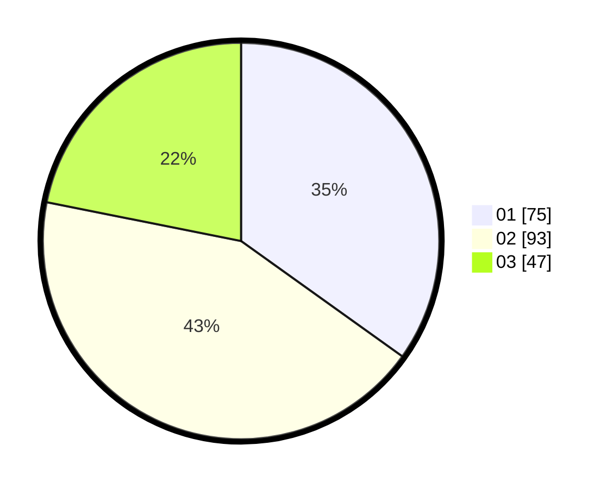

# Hasil

Hasil perolehan suara paslon dapat dilihat pada file paslon-01.txt, paslon-02.txt, dan paslon-03.txt.

Jika tidak ada, artinya data tersebut belum ada pada SIREKAP.

## Perolehan Suara

 * Paslon 01: **75**.
 * Paslon 02: **93**.
 * Paslon 03: **47**.

## Foto C Plano

https://sirekap-obj-formc.kpu.go.id/0382/pemilu/ppwp/31/71/08/10/01/3171081001073-20240216-024051--1a860a61-c56d-43c0-8486-6143aa49d21a.jpg

https://sirekap-obj-formc.kpu.go.id/0382/pemilu/ppwp/31/71/08/10/01/3171081001073-20240216-024053--15e2a8d6-d30e-4010-b2c2-fbef91a59cfb.jpg

https://sirekap-obj-formc.kpu.go.id/0382/pemilu/ppwp/31/71/08/10/01/3171081001073-20240216-024052--6a4bb4bc-4208-4476-8edc-930d84fc4460.jpg

## DATA PEMILIH TETAP

Jumlah pemilih dalam DPT: **203**.
 * L: **93**.
 * P: **110**.

## DATA PENGGUNA HAK PILIH

Jumlah pengguna hak pilih dalam DPT: **203**.
 * L: **93**.
 * P: **110**.

Jumlah pengguna hak pilih dalam DPTb: **8**.
 * L: **4**.
 * P: **4**.

Jumlah pengguna hak pilih dalam DPK: **6**.
 * L: **3**.
 * P: **3**.

Jumlah pengguna hak pilih: **217**.
 * L: **100**.
 * P: **117**.

## JUMLAH SUARA SAH DAN TIDAK SAH

JUMLAH SELURUH SUARA SAH: **215**.

JUMLAH SUARA TIDAK SAH: **4**.

JUMLAH SELURUH SUARA SAH DAN SUARA TIDAK SAH: **219**.
