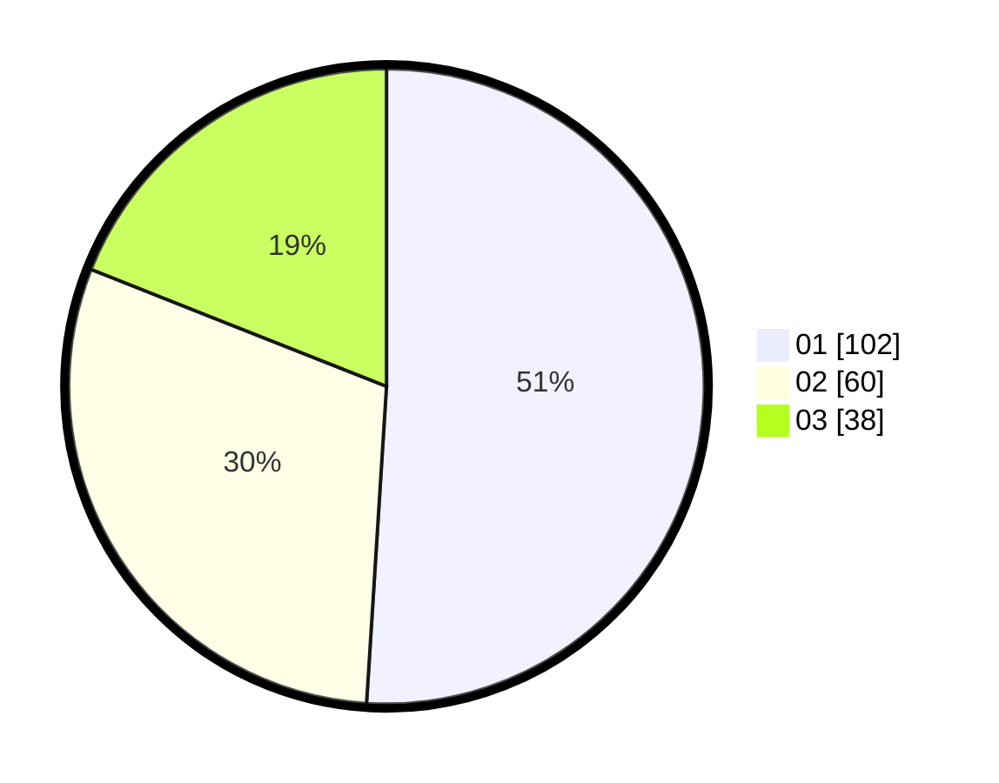

# Hasil

Hasil perolehan suara paslon dapat dilihat pada file paslon-01.txt, paslon-02.txt, dan paslon-03.txt.

Jika tidak ada, artinya data tersebut belum ada pada SIREKAP.

## Perolehan Suara

 * Paslon 01: **102**.
 * Paslon 02: **60**.
 * Paslon 03: **38**.

## Foto C Plano

https://sirekap-obj-formc.kpu.go.id/8800/pemilu/ppwp/31/71/08/10/01/3171081001075-20240216-190430--2d01be6c-7d94-41da-8024-0ed396b5fb1c.jpg

https://sirekap-obj-formc.kpu.go.id/8800/pemilu/ppwp/31/71/08/10/01/3171081001075-20240216-190431--4d61c141-28d0-414d-b1b9-f46af2ad40c6.jpg

https://sirekap-obj-formc.kpu.go.id/8800/pemilu/ppwp/31/71/08/10/01/3171081001075-20240216-190430--5ae35702-35ff-4e58-aeb7-4c907fb27b3f.jpg

## DATA PEMILIH TETAP

Jumlah pemilih dalam DPT: **268**.
 * L: **138**.
 * P: **130**.

## DATA PENGGUNA HAK PILIH

Jumlah pengguna hak pilih dalam DPT: **197**.
 * L: **102**.
 * P: **95**.

Jumlah pengguna hak pilih dalam DPTb: **5**.
 * L: **2**.
 * P: **3**.

Jumlah pengguna hak pilih dalam DPK: **4**.
 * L: **1**.
 * P: **3**.

Jumlah pengguna hak pilih: **206**.
 * L: **105**.
 * P: **101**.

## JUMLAH SUARA SAH DAN TIDAK SAH

JUMLAH SELURUH SUARA SAH: **200**.

JUMLAH SUARA TIDAK SAH: **6**.

JUMLAH SELURUH SUARA SAH DAN SUARA TIDAK SAH: **206**.
