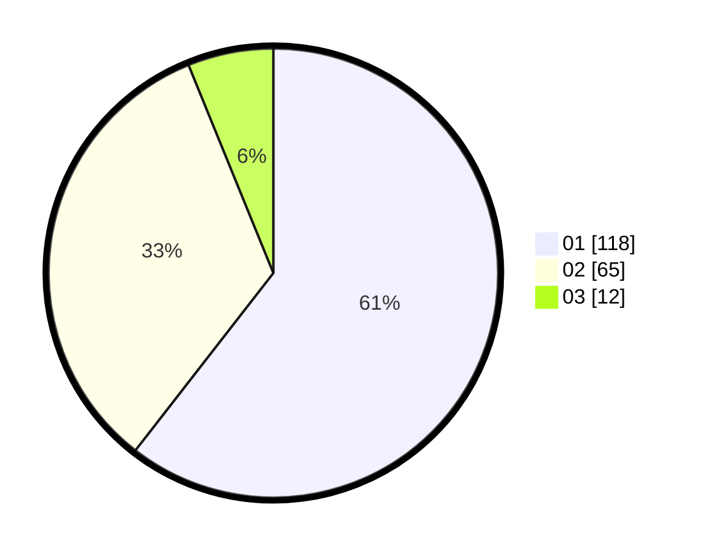

# Hasil

Hasil perolehan suara paslon dapat dilihat pada file paslon-01.txt, paslon-02.txt, dan paslon-03.txt.

Jika tidak ada, artinya data tersebut belum ada pada SIREKAP.

## Perolehan Suara

 * Paslon 01: **118**.
 * Paslon 02: **65**.
 * Paslon 03: **12**.

## Foto C Plano

https://sirekap-obj-formc.kpu.go.id/e0c0/pemilu/ppwp/31/71/08/10/01/3171081001076-20240216-160755--a79904bb-3634-440c-afdc-9f51e60b0e1c.jpg

https://sirekap-obj-formc.kpu.go.id/e0c0/pemilu/ppwp/31/71/08/10/01/3171081001076-20240216-160757--790cd3c7-de8a-4847-87ae-ba9489098739.jpg

https://sirekap-obj-formc.kpu.go.id/e0c0/pemilu/ppwp/31/71/08/10/01/3171081001076-20240216-160756--3ebbabcf-24ed-482a-a13f-dacaf3752ba3.jpg

## DATA PEMILIH TETAP

Jumlah pemilih dalam DPT: **252**.
 * L: **132**.
 * P: **120**.

## DATA PENGGUNA HAK PILIH

Jumlah pengguna hak pilih dalam DPT: **199**.
 * L: **98**.
 * P: **101**.

Jumlah pengguna hak pilih dalam DPTb: **0**.
 * L: **0**.
 * P: **0**.

Jumlah pengguna hak pilih dalam DPK: **2**.
 * L: **1**.
 * P: **1**.

Jumlah pengguna hak pilih: **201**.
 * L: **99**.
 * P: **102**.

## JUMLAH SUARA SAH DAN TIDAK SAH

JUMLAH SELURUH SUARA SAH: **195**.

JUMLAH SUARA TIDAK SAH: **6**.

JUMLAH SELURUH SUARA SAH DAN SUARA TIDAK SAH: **201**.
