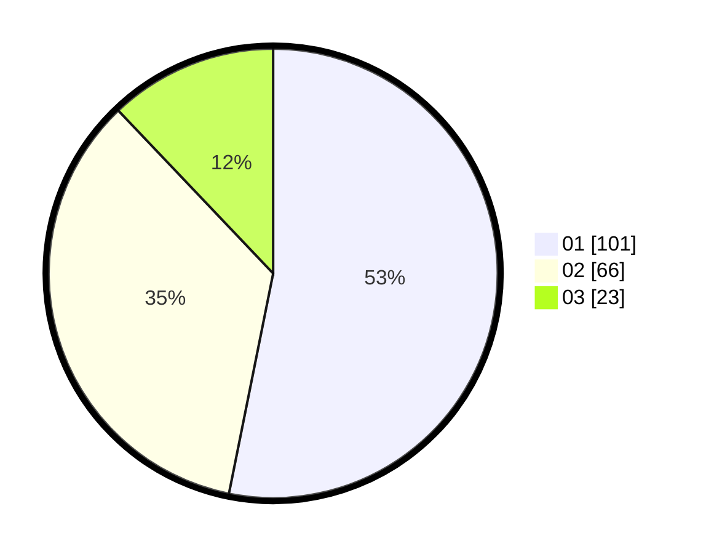

# Hasil

Hasil perolehan suara paslon dapat dilihat pada file paslon-01.txt, paslon-02.txt, dan paslon-03.txt.

Jika tidak ada, artinya data tersebut belum ada pada SIREKAP.

## Perolehan Suara

 * Paslon 01: **101**.
 * Paslon 02: **66**.
 * Paslon 03: **23**.

## Foto C Plano

https://sirekap-obj-formc.kpu.go.id/bd14/pemilu/ppwp/31/71/08/10/01/3171081001078-20240216-160700--1d1985dd-2050-41cf-87b5-f6c6955551b6.jpg

https://sirekap-obj-formc.kpu.go.id/bd14/pemilu/ppwp/31/71/08/10/01/3171081001078-20240214-155036--54924b64-3147-4ad1-aea9-aae6ca804154.jpg

https://sirekap-obj-formc.kpu.go.id/bd14/pemilu/ppwp/31/71/08/10/01/3171081001078-20240216-160701--c02c84e9-f165-4eea-b471-6be16597d62d.jpg

## DATA PEMILIH TETAP

Jumlah pemilih dalam DPT: **244**.
 * L: **120**.
 * P: **124**.

## DATA PENGGUNA HAK PILIH

Jumlah pengguna hak pilih dalam DPT: **197**.
 * L: **92**.
 * P: **105**.

Jumlah pengguna hak pilih dalam DPTb: **0**.
 * L: **0**.
 * P: **0**.

Jumlah pengguna hak pilih dalam DPK: **0**.
 * L: **0**.
 * P: **0**.

Jumlah pengguna hak pilih: **197**.
 * L: **92**.
 * P: **105**.

## JUMLAH SUARA SAH DAN TIDAK SAH

JUMLAH SELURUH SUARA SAH: **190**.

JUMLAH SUARA TIDAK SAH: **7**.

JUMLAH SELURUH SUARA SAH DAN SUARA TIDAK SAH: **197**.
