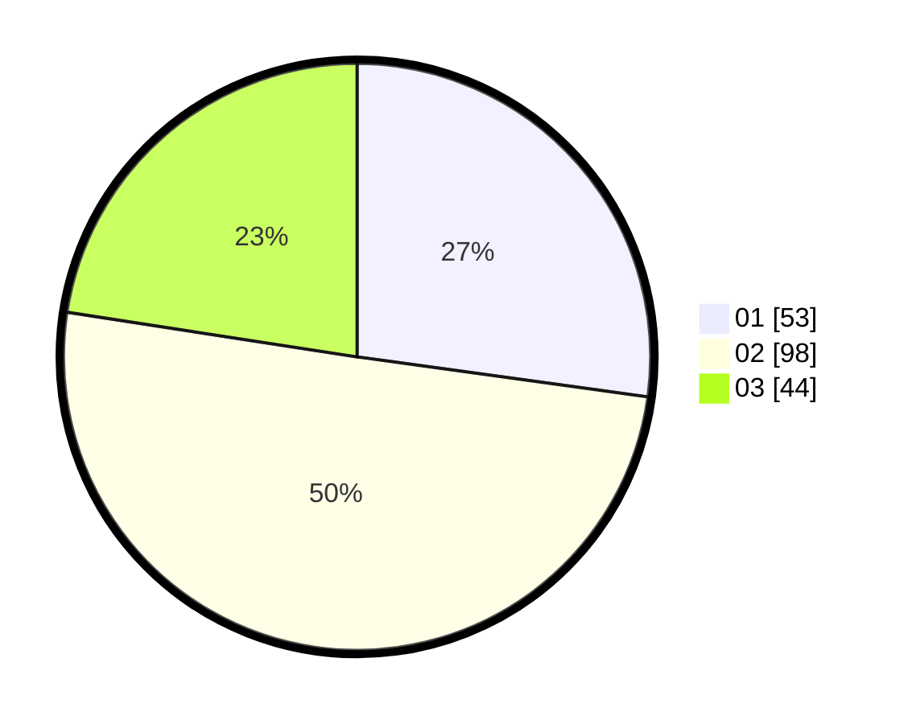

# Hasil

Hasil perolehan suara paslon dapat dilihat pada file paslon-01.txt, paslon-02.txt, dan paslon-03.txt.

Jika tidak ada, artinya data tersebut belum ada pada SIREKAP.

## Perolehan Suara

 * Paslon 01: **53**.
 * Paslon 02: **98**.
 * Paslon 03: **44**.

## Foto C Plano

https://sirekap-obj-formc.kpu.go.id/90a5/pemilu/ppwp/31/71/08/10/01/3171081001085-20240216-152644--0a8058cc-6940-44e7-bcdd-d06cb2a1c42e.jpg

https://sirekap-obj-formc.kpu.go.id/90a5/pemilu/ppwp/31/71/08/10/01/3171081001085-20240216-152645--76a4102e-cac1-42ba-958c-3d6cd1993218.jpg

https://sirekap-obj-formc.kpu.go.id/90a5/pemilu/ppwp/31/71/08/10/01/3171081001085-20240216-152644--6d05fd1d-f1a3-481b-806e-093614960004.jpg

## DATA PEMILIH TETAP

Jumlah pemilih dalam DPT: **240**.
 * L: **121**.
 * P: **119**.

## DATA PENGGUNA HAK PILIH

Jumlah pengguna hak pilih dalam DPT: **197**.
 * L: **94**.
 * P: **103**.

Jumlah pengguna hak pilih dalam DPTb: **1**.
 * L: **0**.
 * P: **1**.

Jumlah pengguna hak pilih dalam DPK: **3**.
 * L: **1**.
 * P: **2**.

Jumlah pengguna hak pilih: **201**.
 * L: **95**.
 * P: **106**.

## JUMLAH SUARA SAH DAN TIDAK SAH

JUMLAH SELURUH SUARA SAH: **195**.

JUMLAH SUARA TIDAK SAH: **6**.

JUMLAH SELURUH SUARA SAH DAN SUARA TIDAK SAH: **201**.
