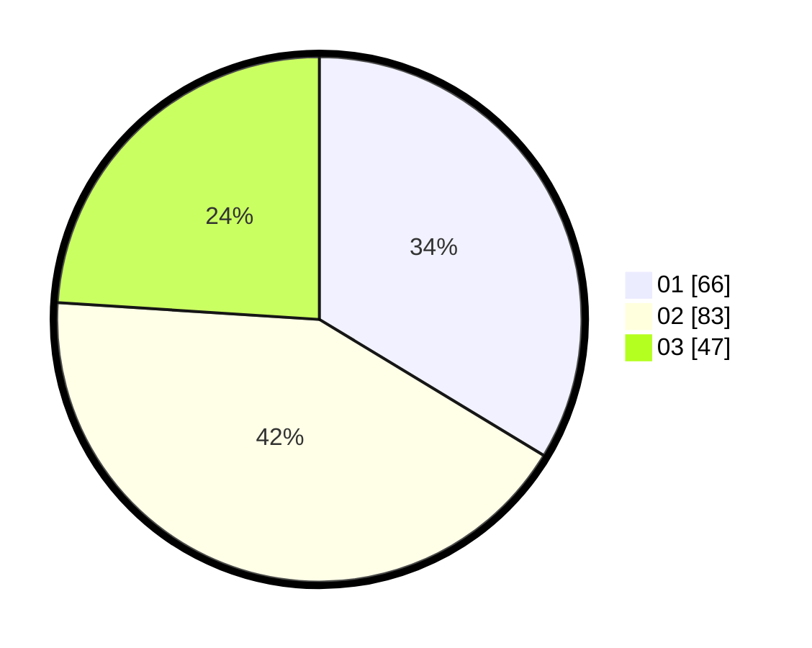

# Hasil

Hasil perolehan suara paslon dapat dilihat pada file paslon-01.txt, paslon-02.txt, dan paslon-03.txt.

Jika tidak ada, artinya data tersebut belum ada pada SIREKAP.

## Perolehan Suara

 * Paslon 01: **66**.
 * Paslon 02: **83**.
 * Paslon 03: **47**.

## Foto C Plano

https://sirekap-obj-formc.kpu.go.id/f70a/pemilu/ppwp/31/71/08/10/01/3171081001086-20240216-161908--8fd779f5-24c7-4899-9baa-8bf2d8b9c2f1.jpg

https://sirekap-obj-formc.kpu.go.id/f70a/pemilu/ppwp/31/71/08/10/01/3171081001086-20240216-161909--579215e4-208b-491a-afe3-97a63f1afa15.jpg

https://sirekap-obj-formc.kpu.go.id/f70a/pemilu/ppwp/31/71/08/10/01/3171081001086-20240216-161909--a4d0f36f-e76e-4d9c-9892-339934a16721.jpg

## DATA PEMILIH TETAP

Jumlah pemilih dalam DPT: **235**.
 * L: **110**.
 * P: **125**.

## DATA PENGGUNA HAK PILIH

Jumlah pengguna hak pilih dalam DPT: **193**.
 * L: **86**.
 * P: **107**.

Jumlah pengguna hak pilih dalam DPTb: **1**.
 * L: **1**.
 * P: **0**.

Jumlah pengguna hak pilih dalam DPK: **4**.
 * L: **1**.
 * P: **3**.

Jumlah pengguna hak pilih: **198**.
 * L: **88**.
 * P: **110**.

## JUMLAH SUARA SAH DAN TIDAK SAH

JUMLAH SELURUH SUARA SAH: **196**.

JUMLAH SUARA TIDAK SAH: **2**.

JUMLAH SELURUH SUARA SAH DAN SUARA TIDAK SAH: **198**.
