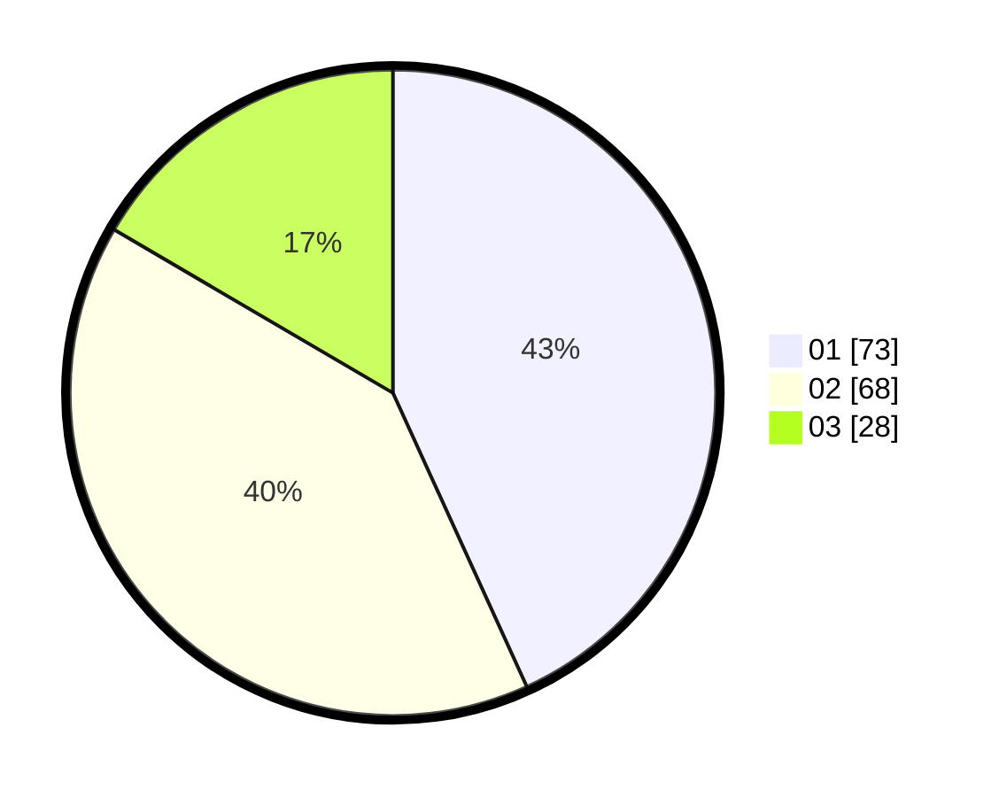

# Hasil

Hasil perolehan suara paslon dapat dilihat pada file paslon-01.txt, paslon-02.txt, dan paslon-03.txt.

Jika tidak ada, artinya data tersebut belum ada pada SIREKAP.

## Perolehan Suara

 * Paslon 01: **73**.
 * Paslon 02: **68**.
 * Paslon 03: **28**.

## Foto C Plano

https://sirekap-obj-formc.kpu.go.id/f780/pemilu/ppwp/31/71/08/10/01/3171081001087-20240216-144505--b1c8beac-4136-4a31-a666-1a974e2d4bd3.jpg

https://sirekap-obj-formc.kpu.go.id/f780/pemilu/ppwp/31/71/08/10/01/3171081001087-20240216-144507--3637c7fa-517c-47b4-8b78-5f3e97cda744.jpg

https://sirekap-obj-formc.kpu.go.id/f780/pemilu/ppwp/31/71/08/10/01/3171081001087-20240216-144506--3f2b97df-f436-443d-b8ff-8300ce677771.jpg

## DATA PEMILIH TETAP

Jumlah pemilih dalam DPT: **228**.
 * L: **109**.
 * P: **119**.

## DATA PENGGUNA HAK PILIH

Jumlah pengguna hak pilih dalam DPT: **164**.
 * L: **74**.
 * P: **90**.

Jumlah pengguna hak pilih dalam DPTb: **5**.
 * L: **0**.
 * P: **5**.

Jumlah pengguna hak pilih dalam DPK: **4**.
 * L: **2**.
 * P: **2**.

Jumlah pengguna hak pilih: **173**.
 * L: **76**.
 * P: **97**.

## JUMLAH SUARA SAH DAN TIDAK SAH

JUMLAH SELURUH SUARA SAH: **169**.

JUMLAH SUARA TIDAK SAH: **4**.

JUMLAH SELURUH SUARA SAH DAN SUARA TIDAK SAH: **173**.
