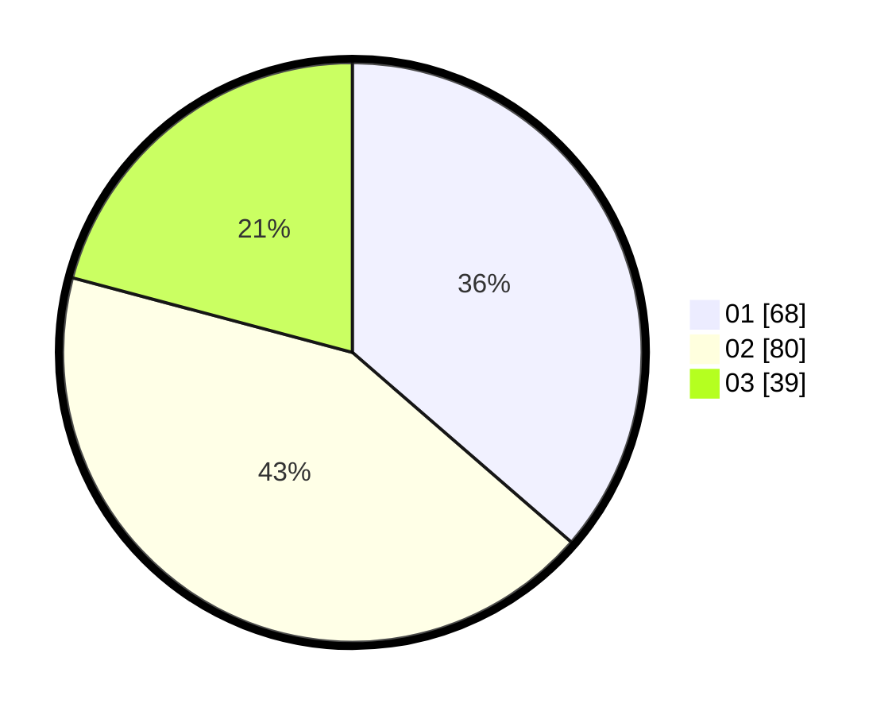

# Hasil

Hasil perolehan suara paslon dapat dilihat pada file paslon-01.txt, paslon-02.txt, dan paslon-03.txt.

Jika tidak ada, artinya data tersebut belum ada pada SIREKAP.

## Perolehan Suara

 * Paslon 01: **68**.
 * Paslon 02: **80**.
 * Paslon 03: **39**.

## Foto C Plano

https://sirekap-obj-formc.kpu.go.id/3472/pemilu/ppwp/31/71/08/10/01/3171081001089-20240216-152641--c1e9ba48-d98d-41b7-8458-e91a1ccacda8.jpg

https://sirekap-obj-formc.kpu.go.id/3472/pemilu/ppwp/31/71/08/10/01/3171081001089-20240216-152643--ccf9b31e-47de-4e13-a4cc-54e5659a9772.jpg

https://sirekap-obj-formc.kpu.go.id/3472/pemilu/ppwp/31/71/08/10/01/3171081001089-20240216-152642--27332e81-6f5c-428f-bb9c-62e91d71feab.jpg

## DATA PEMILIH TETAP

Jumlah pemilih dalam DPT: **228**.
 * L: **110**.
 * P: **118**.

## DATA PENGGUNA HAK PILIH

Jumlah pengguna hak pilih dalam DPT: **179**.
 * L: **80**.
 * P: **99**.

Jumlah pengguna hak pilih dalam DPTb: **8**.
 * L: **2**.
 * P: **6**.

Jumlah pengguna hak pilih dalam DPK: **3**.
 * L: **2**.
 * P: **1**.

Jumlah pengguna hak pilih: **190**.
 * L: **84**.
 * P: **106**.

## JUMLAH SUARA SAH DAN TIDAK SAH

JUMLAH SELURUH SUARA SAH: **187**.

JUMLAH SUARA TIDAK SAH: **3**.

JUMLAH SELURUH SUARA SAH DAN SUARA TIDAK SAH: **190**.
