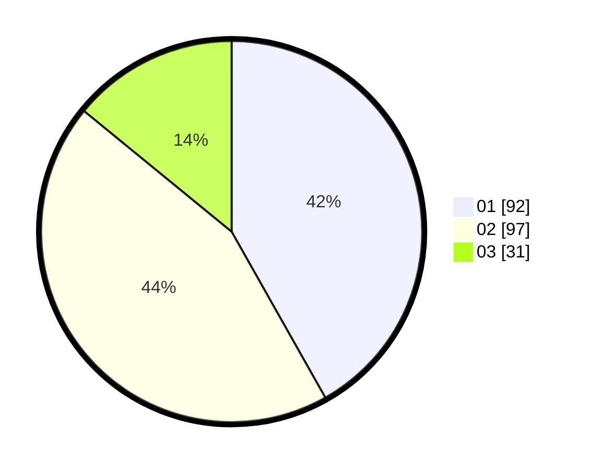

# Hasil

Hasil perolehan suara paslon dapat dilihat pada file paslon-01.txt, paslon-02.txt, dan paslon-03.txt.

Jika tidak ada, artinya data tersebut belum ada pada SIREKAP.

## Perolehan Suara

 * Paslon 01: **92**.
 * Paslon 02: **97**.
 * Paslon 03: **31**.

## Foto C Plano

https://sirekap-obj-formc.kpu.go.id/e401/pemilu/ppwp/31/71/08/10/01/3171081001094-20240216-155940--392a4006-fbfb-4ea0-b629-d690913fa562.jpg

https://sirekap-obj-formc.kpu.go.id/e401/pemilu/ppwp/31/71/08/10/01/3171081001094-20240216-155942--6d6ce0a1-3564-4203-8038-a69a05f7000e.jpg

https://sirekap-obj-formc.kpu.go.id/e401/pemilu/ppwp/31/71/08/10/01/3171081001094-20240216-155941--259645b6-dfd0-4704-9a36-d1ac8cc9b13e.jpg

## DATA PEMILIH TETAP

Jumlah pemilih dalam DPT: **281**.
 * L: **139**.
 * P: **142**.

## DATA PENGGUNA HAK PILIH

Jumlah pengguna hak pilih dalam DPT: **221**.
 * L: **106**.
 * P: **115**.

Jumlah pengguna hak pilih dalam DPTb: **1**.
 * L: **0**.
 * P: **1**.

Jumlah pengguna hak pilih dalam DPK: **4**.
 * L: **3**.
 * P: **1**.

Jumlah pengguna hak pilih: **226**.
 * L: **109**.
 * P: **117**.

## JUMLAH SUARA SAH DAN TIDAK SAH

JUMLAH SELURUH SUARA SAH: **220**.

JUMLAH SUARA TIDAK SAH: **6**.

JUMLAH SELURUH SUARA SAH DAN SUARA TIDAK SAH: **226**.
