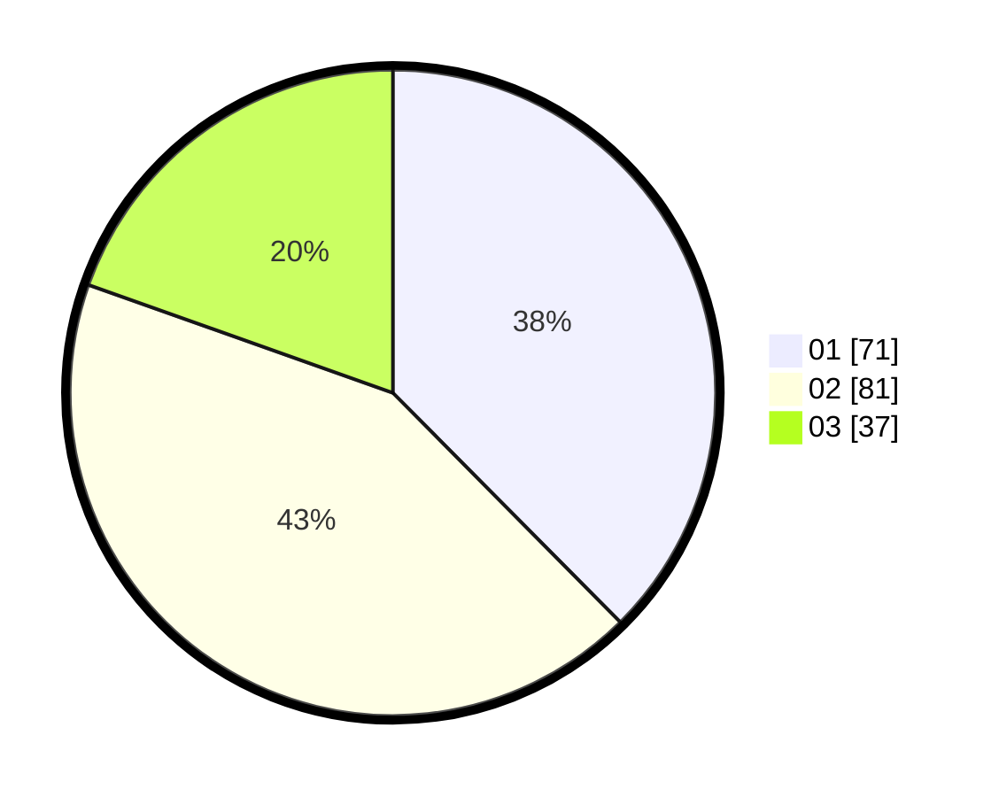

# Hasil

Hasil perolehan suara paslon dapat dilihat pada file paslon-01.txt, paslon-02.txt, dan paslon-03.txt.

Jika tidak ada, artinya data tersebut belum ada pada SIREKAP.

## Perolehan Suara

 * Paslon 01: **71**.
 * Paslon 02: **81**.
 * Paslon 03: **37**.

## Foto C Plano

https://sirekap-obj-formc.kpu.go.id/02ba/pemilu/ppwp/31/71/08/10/01/3171081001096-20240216-160012--97194baf-0e92-4296-8ad6-e9cef5a1242a.jpg

https://sirekap-obj-formc.kpu.go.id/02ba/pemilu/ppwp/31/71/08/10/01/3171081001096-20240216-160013--5c54e8bb-240a-4f4a-8736-1ef22fdbe30c.jpg

https://sirekap-obj-formc.kpu.go.id/02ba/pemilu/ppwp/31/71/08/10/01/3171081001096-20240216-160012--363ba0c4-567e-4c1f-9b9e-95932c6850c1.jpg

## DATA PEMILIH TETAP

Jumlah pemilih dalam DPT: **268**.
 * L: **131**.
 * P: **137**.

## DATA PENGGUNA HAK PILIH

Jumlah pengguna hak pilih dalam DPT: **184**.
 * L: **85**.
 * P: **99**.

Jumlah pengguna hak pilih dalam DPTb: **3**.
 * L: **0**.
 * P: **3**.

Jumlah pengguna hak pilih dalam DPK: **12**.
 * L: **3**.
 * P: **9**.

Jumlah pengguna hak pilih: **199**.
 * L: **88**.
 * P: **111**.

## JUMLAH SUARA SAH DAN TIDAK SAH

JUMLAH SELURUH SUARA SAH: **189**.

JUMLAH SUARA TIDAK SAH: **10**.

JUMLAH SELURUH SUARA SAH DAN SUARA TIDAK SAH: **199**.
