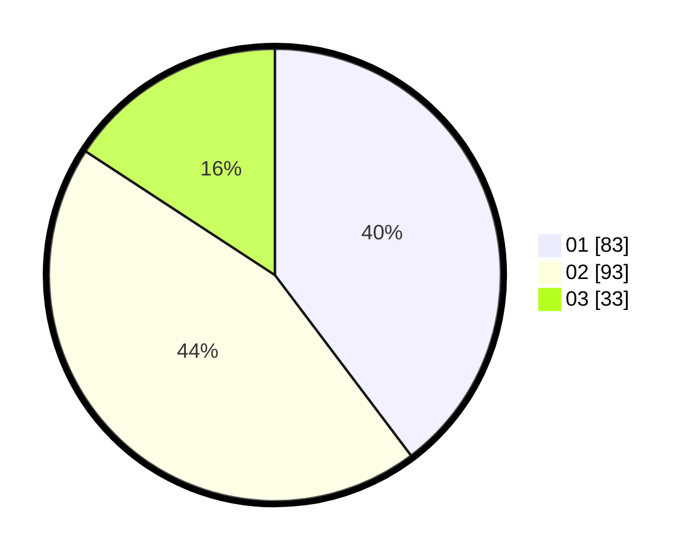

# Hasil

Hasil perolehan suara paslon dapat dilihat pada file paslon-01.txt, paslon-02.txt, dan paslon-03.txt.

Jika tidak ada, artinya data tersebut belum ada pada SIREKAP.

## Perolehan Suara

 * Paslon 01: **83**.
 * Paslon 02: **93**.
 * Paslon 03: **33**.

## Foto C Plano

https://sirekap-obj-formc.kpu.go.id/5fc6/pemilu/ppwp/31/71/08/10/01/3171081001098-20240216-155132--76e6d3ae-3d41-4b32-8f74-0fa5f3a9ebdd.jpg

https://sirekap-obj-formc.kpu.go.id/5fc6/pemilu/ppwp/31/71/08/10/01/3171081001098-20240216-155133--7a84be34-d276-40d7-9691-6902e27023a8.jpg

https://sirekap-obj-formc.kpu.go.id/5fc6/pemilu/ppwp/31/71/08/10/01/3171081001098-20240216-155132--9fe23b00-34aa-4cf4-8881-e3ee9a3582dc.jpg

## DATA PEMILIH TETAP

Jumlah pemilih dalam DPT: **260**.
 * L: **129**.
 * P: **131**.

## DATA PENGGUNA HAK PILIH

Jumlah pengguna hak pilih dalam DPT: **210**.
 * L: **103**.
 * P: **107**.

Jumlah pengguna hak pilih dalam DPTb: **0**.
 * L: **0**.
 * P: **0**.

Jumlah pengguna hak pilih dalam DPK: **0**.
 * L: **0**.
 * P: **0**.

Jumlah pengguna hak pilih: **210**.
 * L: **103**.
 * P: **107**.

## JUMLAH SUARA SAH DAN TIDAK SAH

JUMLAH SELURUH SUARA SAH: **209**.

JUMLAH SUARA TIDAK SAH: **1**.

JUMLAH SELURUH SUARA SAH DAN SUARA TIDAK SAH: **210**.
