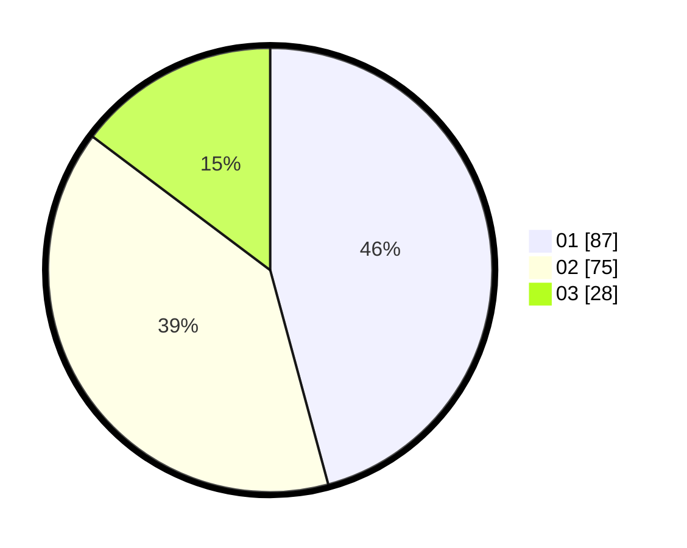

# Hasil

Hasil perolehan suara paslon dapat dilihat pada file paslon-01.txt, paslon-02.txt, dan paslon-03.txt.

Jika tidak ada, artinya data tersebut belum ada pada SIREKAP.

## Perolehan Suara

 * Paslon 01: **87**.
 * Paslon 02: **75**.
 * Paslon 03: **28**.

## Foto C Plano

https://sirekap-obj-formc.kpu.go.id/348d/pemilu/ppwp/31/71/08/10/01/3171081001099-20240215-203148--8d6d8920-e620-4892-a0c5-b906bffac3a8.jpg

https://sirekap-obj-formc.kpu.go.id/348d/pemilu/ppwp/31/71/08/10/01/3171081001099-20240215-203154--1dc7d26d-8056-4c1d-ab5f-3077ad9a82de.jpg

https://sirekap-obj-formc.kpu.go.id/348d/pemilu/ppwp/31/71/08/10/01/3171081001099-20240215-203152--f2e7738c-3543-411c-bbb0-608a9ebde212.jpg

## DATA PEMILIH TETAP

Jumlah pemilih dalam DPT: **249**.
 * L: **127**.
 * P: **122**.

## DATA PENGGUNA HAK PILIH

Jumlah pengguna hak pilih dalam DPT: **189**.
 * L: **91**.
 * P: **98**.

Jumlah pengguna hak pilih dalam DPTb: **0**.
 * L: **0**.
 * P: **0**.

Jumlah pengguna hak pilih dalam DPK: **3**.
 * L: **0**.
 * P: **3**.

Jumlah pengguna hak pilih: **192**.
 * L: **91**.
 * P: **101**.

## JUMLAH SUARA SAH DAN TIDAK SAH

JUMLAH SELURUH SUARA SAH: **190**.

JUMLAH SUARA TIDAK SAH: **2**.

JUMLAH SELURUH SUARA SAH DAN SUARA TIDAK SAH: **192**.
