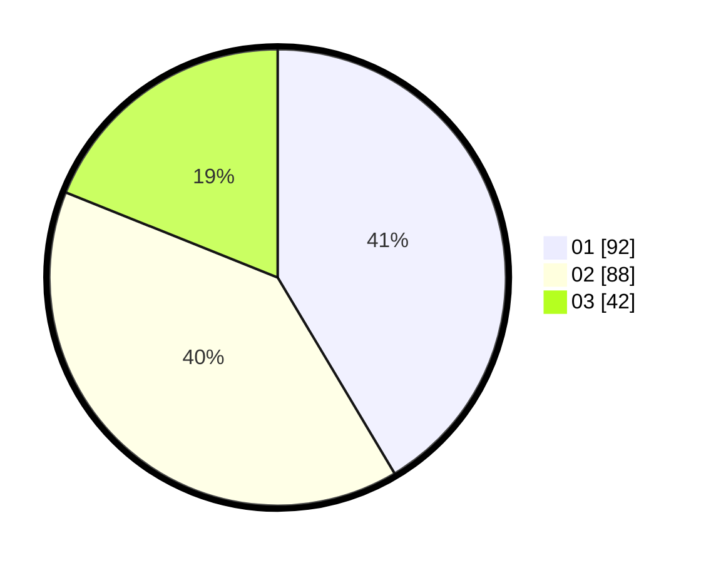

# Hasil

Hasil perolehan suara paslon dapat dilihat pada file paslon-01.txt, paslon-02.txt, dan paslon-03.txt.

Jika tidak ada, artinya data tersebut belum ada pada SIREKAP.

## Perolehan Suara

 * Paslon 01: **92**.
 * Paslon 02: **88**.
 * Paslon 03: **42**.

## Foto C Plano

https://sirekap-obj-formc.kpu.go.id/722d/pemilu/ppwp/31/71/08/10/01/3171081001104-20240216-153414--cb88b2f1-f408-4cf4-b349-d39a467ead8d.jpg

https://sirekap-obj-formc.kpu.go.id/722d/pemilu/ppwp/31/71/08/10/01/3171081001104-20240216-153415--2ec81a3f-5978-4ff9-8105-853214ce190e.jpg

https://sirekap-obj-formc.kpu.go.id/722d/pemilu/ppwp/31/71/08/10/01/3171081001104-20240216-153414--8ff0921f-16f6-4127-b5f9-a7dfc184289e.jpg

## DATA PEMILIH TETAP

Jumlah pemilih dalam DPT: **252**.
 * L: **115**.
 * P: **137**.

## DATA PENGGUNA HAK PILIH

Jumlah pengguna hak pilih dalam DPT: **219**.
 * L: **101**.
 * P: **118**.

Jumlah pengguna hak pilih dalam DPTb: **3**.
 * L: **2**.
 * P: **1**.

Jumlah pengguna hak pilih dalam DPK: **4**.
 * L: **2**.
 * P: **2**.

Jumlah pengguna hak pilih: **226**.
 * L: **105**.
 * P: **121**.

## JUMLAH SUARA SAH DAN TIDAK SAH

JUMLAH SELURUH SUARA SAH: **222**.

JUMLAH SUARA TIDAK SAH: **4**.

JUMLAH SELURUH SUARA SAH DAN SUARA TIDAK SAH: **226**.
