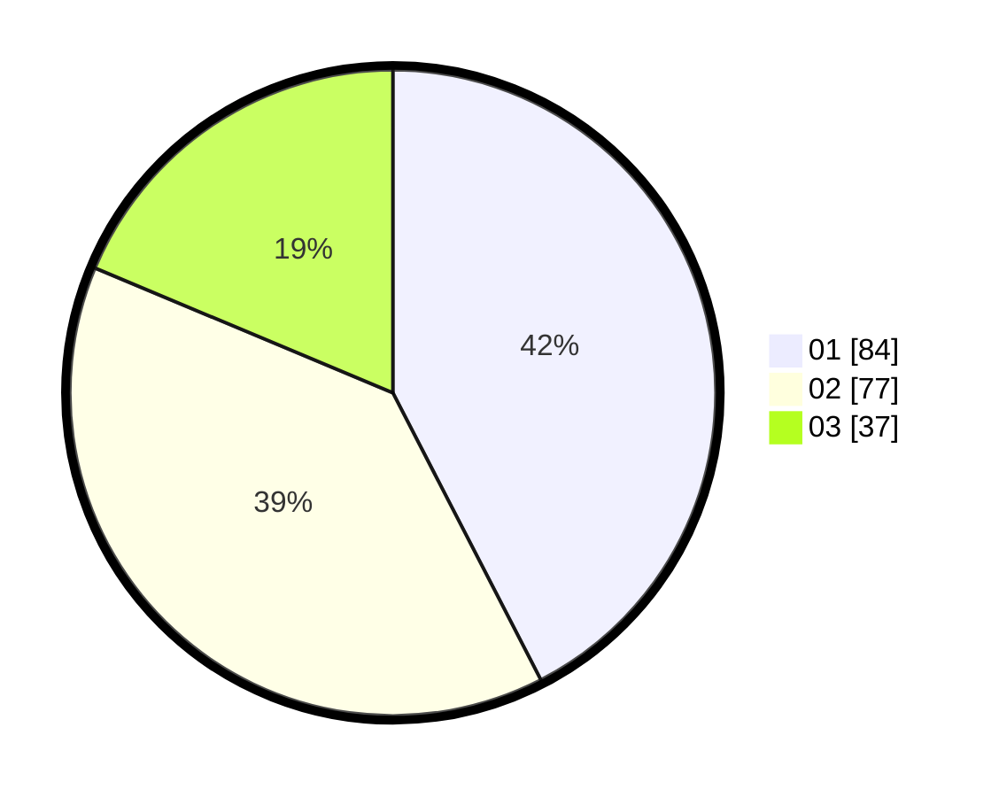

# Hasil

Hasil perolehan suara paslon dapat dilihat pada file paslon-01.txt, paslon-02.txt, dan paslon-03.txt.

Jika tidak ada, artinya data tersebut belum ada pada SIREKAP.

## Perolehan Suara

 * Paslon 01: **84**.
 * Paslon 02: **77**.
 * Paslon 03: **37**.

## Foto C Plano

https://sirekap-obj-formc.kpu.go.id/5f1e/pemilu/ppwp/31/71/08/10/01/3171081001108-20240216-162955--90da94eb-1657-4584-838a-5403f40f8953.jpg

https://sirekap-obj-formc.kpu.go.id/5f1e/pemilu/ppwp/31/71/08/10/01/3171081001108-20240216-162956--c5ec36c6-348c-4e9e-b494-157133ee7712.jpg

https://sirekap-obj-formc.kpu.go.id/5f1e/pemilu/ppwp/31/71/08/10/01/3171081001108-20240216-162955--62fbea2d-97ea-46ca-8a4d-5c998bfdb2ef.jpg

## DATA PEMILIH TETAP

Jumlah pemilih dalam DPT: **246**.
 * L: **122**.
 * P: **124**.

## DATA PENGGUNA HAK PILIH

Jumlah pengguna hak pilih dalam DPT: **195**.
 * L: **91**.
 * P: **104**.

Jumlah pengguna hak pilih dalam DPTb: **4**.
 * L: **2**.
 * P: **2**.

Jumlah pengguna hak pilih dalam DPK: **3**.
 * L: **2**.
 * P: **1**.

Jumlah pengguna hak pilih: **202**.
 * L: **95**.
 * P: **107**.

## JUMLAH SUARA SAH DAN TIDAK SAH

JUMLAH SELURUH SUARA SAH: **198**.

JUMLAH SUARA TIDAK SAH: **4**.

JUMLAH SELURUH SUARA SAH DAN SUARA TIDAK SAH: **202**.
