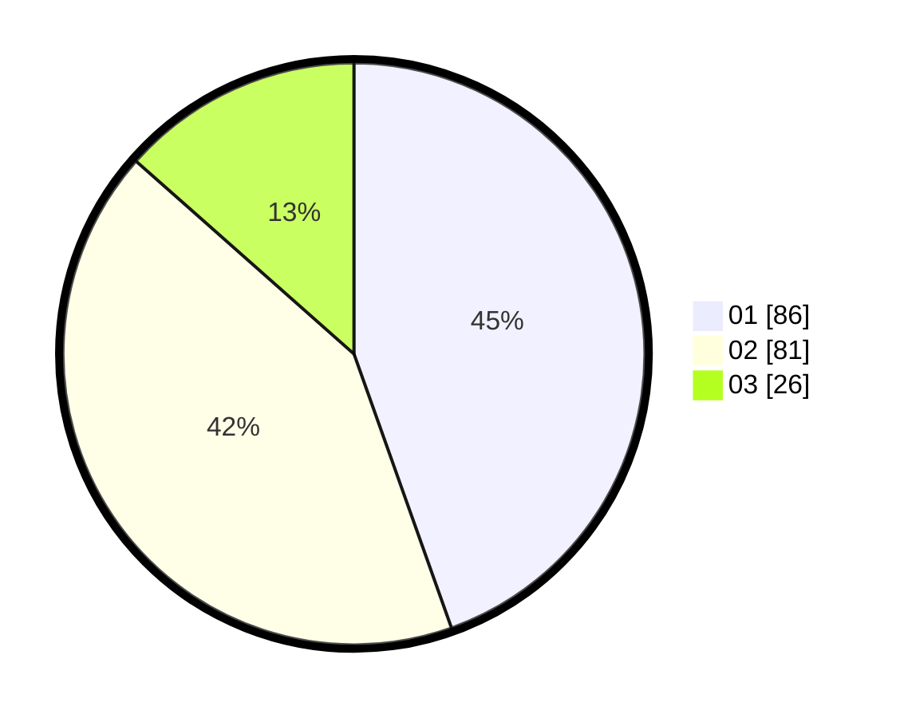

# Hasil

Hasil perolehan suara paslon dapat dilihat pada file paslon-01.txt, paslon-02.txt, dan paslon-03.txt.

Jika tidak ada, artinya data tersebut belum ada pada SIREKAP.

## Perolehan Suara

 * Paslon 01: **86**.
 * Paslon 02: **81**.
 * Paslon 03: **26**.

## Foto C Plano

https://sirekap-obj-formc.kpu.go.id/36ca/pemilu/ppwp/31/71/08/10/01/3171081001111-20240216-112313--0e32d64b-12c5-4685-8eaf-a6d3350c4d04.jpg

https://sirekap-obj-formc.kpu.go.id/36ca/pemilu/ppwp/31/71/08/10/01/3171081001111-20240214-224741--e009a6f9-45c4-4ea8-b1b9-ec3fb1668196.jpg

https://sirekap-obj-formc.kpu.go.id/36ca/pemilu/ppwp/31/71/08/10/01/3171081001111-20240216-112314--e510ebbe-29a3-40da-a944-fab482fea222.jpg

## DATA PEMILIH TETAP

Jumlah pemilih dalam DPT: **252**.
 * L: **130**.
 * P: **122**.

## DATA PENGGUNA HAK PILIH

Jumlah pengguna hak pilih dalam DPT: **196**.
 * L: **102**.
 * P: **94**.

Jumlah pengguna hak pilih dalam DPTb: **1**.
 * L: **0**.
 * P: **1**.

Jumlah pengguna hak pilih dalam DPK: **1**.
 * L: **0**.
 * P: **1**.

Jumlah pengguna hak pilih: **198**.
 * L: **102**.
 * P: **96**.

## JUMLAH SUARA SAH DAN TIDAK SAH

JUMLAH SELURUH SUARA SAH: **193**.

JUMLAH SUARA TIDAK SAH: **5**.

JUMLAH SELURUH SUARA SAH DAN SUARA TIDAK SAH: **198**.
