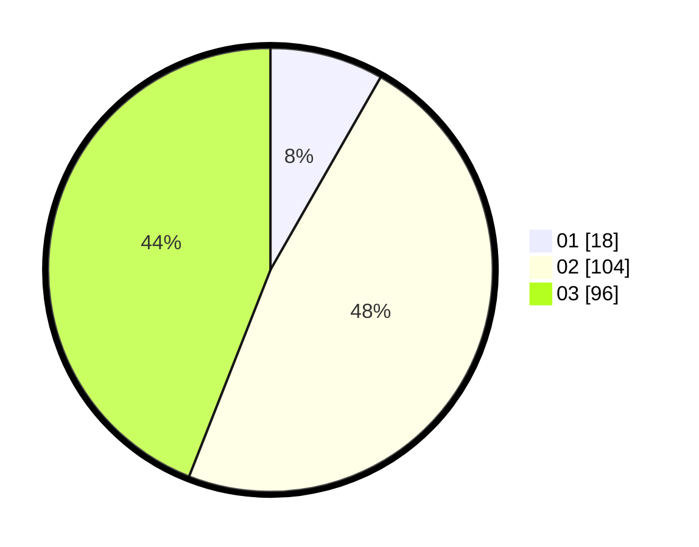

# Hasil

Hasil perolehan suara paslon dapat dilihat pada file paslon-01.txt, paslon-02.txt, dan paslon-03.txt.

Jika tidak ada, artinya data tersebut belum ada pada SIREKAP.

## Perolehan Suara

 * Paslon 01: **18**.
 * Paslon 02: **104**.
 * Paslon 03: **96**.

## Foto C Plano

https://sirekap-obj-formc.kpu.go.id/e4e1/pemilu/ppwp/31/71/08/10/01/3171081001112-20240216-163135--875344ae-45b2-4d60-83a3-bb819656fe11.jpg

https://sirekap-obj-formc.kpu.go.id/e4e1/pemilu/ppwp/31/71/08/10/01/3171081001112-20240216-163136--9f025227-2017-4dc8-bfb0-49a37bcfcd3c.jpg

https://sirekap-obj-formc.kpu.go.id/e4e1/pemilu/ppwp/31/71/08/10/01/3171081001112-20240216-163136--055f5a64-0120-4923-bbc6-558b93d46df4.jpg

## DATA PEMILIH TETAP

Jumlah pemilih dalam DPT: **270**.
 * L: **124**.
 * P: **146**.

## DATA PENGGUNA HAK PILIH

Jumlah pengguna hak pilih dalam DPT: **196**.
 * L: **92**.
 * P: **104**.

Jumlah pengguna hak pilih dalam DPTb: **15**.
 * L: **9**.
 * P: **6**.

Jumlah pengguna hak pilih dalam DPK: **8**.
 * L: **2**.
 * P: **6**.

Jumlah pengguna hak pilih: **219**.
 * L: **103**.
 * P: **116**.

## JUMLAH SUARA SAH DAN TIDAK SAH

JUMLAH SELURUH SUARA SAH: **218**.

JUMLAH SUARA TIDAK SAH: **1**.

JUMLAH SELURUH SUARA SAH DAN SUARA TIDAK SAH: **219**.
