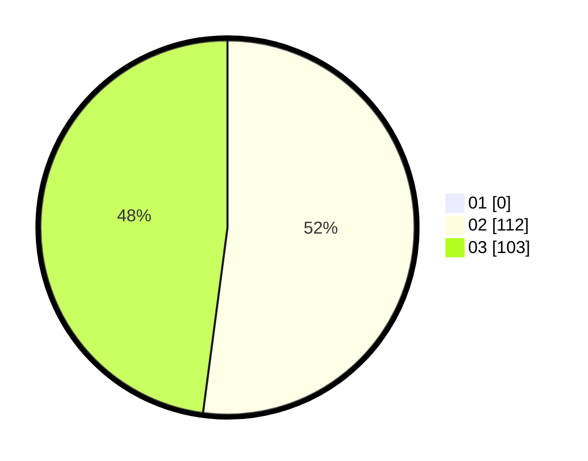

# Hasil

Hasil perolehan suara paslon dapat dilihat pada file paslon-01.txt, paslon-02.txt, dan paslon-03.txt.

Jika tidak ada, artinya data tersebut belum ada pada SIREKAP.

## Perolehan Suara

 * Paslon 01: **0**.
 * Paslon 02: **112**.
 * Paslon 03: **103**.

## Foto C Plano

https://sirekap-obj-formc.kpu.go.id/a09b/pemilu/ppwp/31/71/08/10/01/3171081001113-20240216-153436--48d2ee43-52fe-4fd0-bdd5-53eb70097bdf.jpg

https://sirekap-obj-formc.kpu.go.id/a09b/pemilu/ppwp/31/71/08/10/01/3171081001113-20240216-153438--90b09759-e48c-4b28-9bfe-7b0c85eb6634.jpg

https://sirekap-obj-formc.kpu.go.id/a09b/pemilu/ppwp/31/71/08/10/01/3171081001113-20240216-153437--10b7f176-dbdd-4919-bbb6-a9a75ecc0939.jpg

## DATA PEMILIH TETAP

Jumlah pemilih dalam DPT: **262**.
 * L: **124**.
 * P: **138**.

## DATA PENGGUNA HAK PILIH

Jumlah pengguna hak pilih dalam DPT: **197**.
 * L: **88**.
 * P: **109**.

Jumlah pengguna hak pilih dalam DPTb: **1**.
 * L: **0**.
 * P: **1**.

Jumlah pengguna hak pilih dalam DPK: **19**.
 * L: **7**.
 * P: **12**.

Jumlah pengguna hak pilih: **217**.
 * L: **95**.
 * P: **122**.

## JUMLAH SUARA SAH DAN TIDAK SAH

JUMLAH SELURUH SUARA SAH: **215**.

JUMLAH SUARA TIDAK SAH: **2**.

JUMLAH SELURUH SUARA SAH DAN SUARA TIDAK SAH: **217**.
