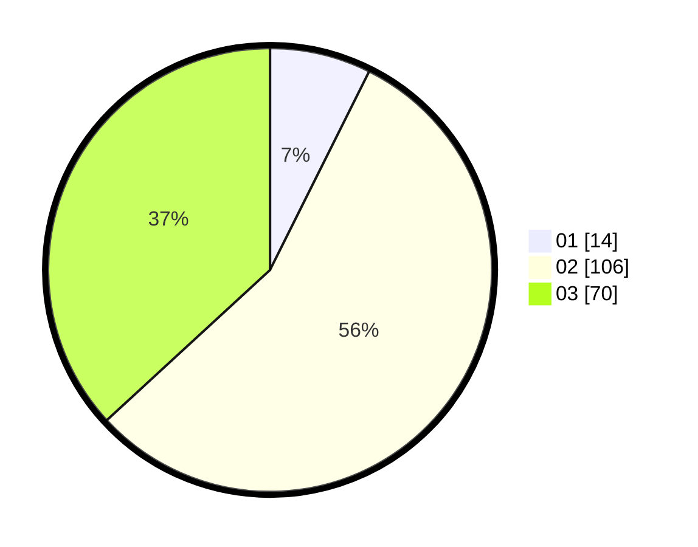

# Hasil

Hasil perolehan suara paslon dapat dilihat pada file paslon-01.txt, paslon-02.txt, dan paslon-03.txt.

Jika tidak ada, artinya data tersebut belum ada pada SIREKAP.

## Perolehan Suara

 * Paslon 01: **14**.
 * Paslon 02: **106**.
 * Paslon 03: **70**.

## Foto C Plano

https://sirekap-obj-formc.kpu.go.id/bdf2/pemilu/ppwp/31/71/08/10/01/3171081001116-20240216-152444--92653d78-ca9c-48c6-b389-2afd3cc3dc71.jpg

https://sirekap-obj-formc.kpu.go.id/bdf2/pemilu/ppwp/31/71/08/10/01/3171081001116-20240216-152445--103347de-6bc5-41f2-b3ff-25d1c02adb1d.jpg

https://sirekap-obj-formc.kpu.go.id/bdf2/pemilu/ppwp/31/71/08/10/01/3171081001116-20240216-152444--053b8860-4b5a-408b-b63d-5e5d3d6510d4.jpg

## DATA PEMILIH TETAP

Jumlah pemilih dalam DPT: **252**.
 * L: **117**.
 * P: **135**.

## DATA PENGGUNA HAK PILIH

Jumlah pengguna hak pilih dalam DPT: **186**.
 * L: **84**.
 * P: **102**.

Jumlah pengguna hak pilih dalam DPTb: **5**.
 * L: **2**.
 * P: **3**.

Jumlah pengguna hak pilih dalam DPK: **1**.
 * L: **0**.
 * P: **1**.

Jumlah pengguna hak pilih: **192**.
 * L: **86**.
 * P: **106**.

## JUMLAH SUARA SAH DAN TIDAK SAH

JUMLAH SELURUH SUARA SAH: **190**.

JUMLAH SUARA TIDAK SAH: **2**.

JUMLAH SELURUH SUARA SAH DAN SUARA TIDAK SAH: **192**.
