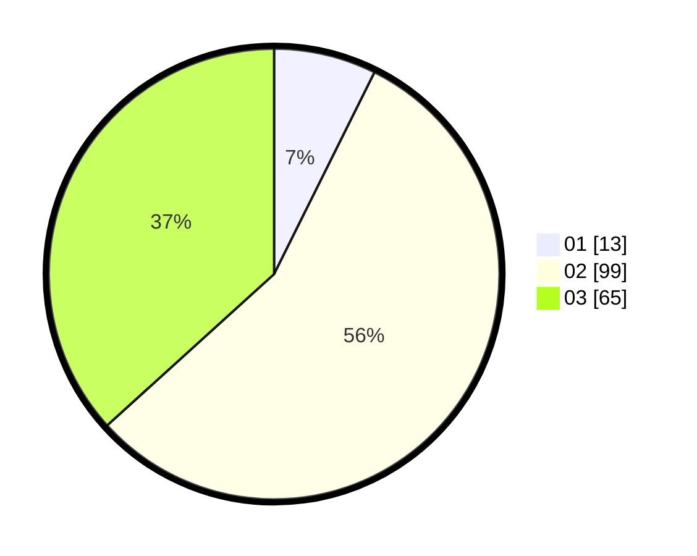

# Hasil

Hasil perolehan suara paslon dapat dilihat pada file paslon-01.txt, paslon-02.txt, dan paslon-03.txt.

Jika tidak ada, artinya data tersebut belum ada pada SIREKAP.

## Perolehan Suara

 * Paslon 01: **13**.
 * Paslon 02: **99**.
 * Paslon 03: **65**.

## Foto C Plano

https://sirekap-obj-formc.kpu.go.id/4862/pemilu/ppwp/31/71/08/10/01/3171081001119-20240215-230912--8e2d4bbc-c2ce-4c60-9f29-43a900994250.jpg

https://sirekap-obj-formc.kpu.go.id/4862/pemilu/ppwp/31/71/08/10/01/3171081001119-20240215-230916--b16b6755-9929-42c3-b8c4-3572f1d7e73b.jpg

https://sirekap-obj-formc.kpu.go.id/4862/pemilu/ppwp/31/71/08/10/01/3171081001119-20240215-230913--7f4b85a4-0a71-4f3a-b6cb-567d144c2ac4.jpg

## DATA PEMILIH TETAP

Jumlah pemilih dalam DPT: **244**.
 * L: **106**.
 * P: **138**.

## DATA PENGGUNA HAK PILIH

Jumlah pengguna hak pilih dalam DPT: **179**.
 * L: **78**.
 * P: **101**.

Jumlah pengguna hak pilih dalam DPTb: **0**.
 * L: **0**.
 * P: **0**.

Jumlah pengguna hak pilih dalam DPK: **1**.
 * L: **0**.
 * P: **1**.

Jumlah pengguna hak pilih: **180**.
 * L: **78**.
 * P: **102**.

## JUMLAH SUARA SAH DAN TIDAK SAH

JUMLAH SELURUH SUARA SAH: **177**.

JUMLAH SUARA TIDAK SAH: **3**.

JUMLAH SELURUH SUARA SAH DAN SUARA TIDAK SAH: **180**.
