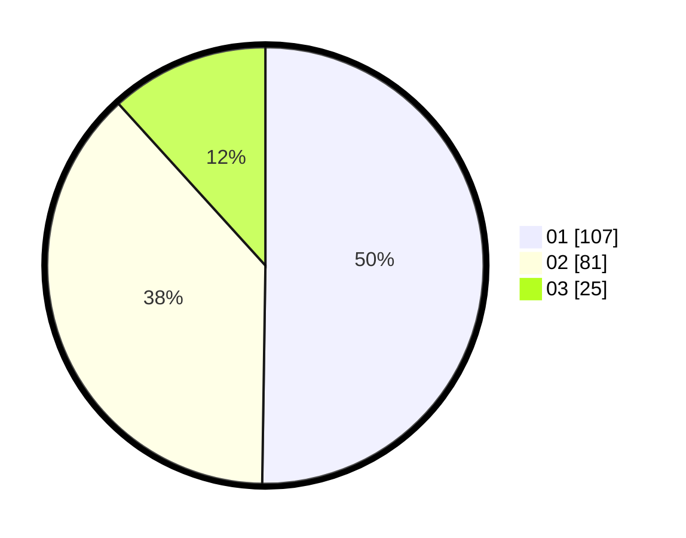

# Hasil

Hasil perolehan suara paslon dapat dilihat pada file paslon-01.txt, paslon-02.txt, dan paslon-03.txt.

Jika tidak ada, artinya data tersebut belum ada pada SIREKAP.

## Perolehan Suara

 * Paslon 01: **107**.
 * Paslon 02: **81**.
 * Paslon 03: **25**.

## Foto C Plano

https://sirekap-obj-formc.kpu.go.id/f8cf/pemilu/ppwp/31/71/08/10/01/3171081001120-20240216-150510--6e956894-ce52-49fd-be1d-40ef965ceaa2.jpg

https://sirekap-obj-formc.kpu.go.id/f8cf/pemilu/ppwp/31/71/08/10/01/3171081001120-20240216-150511--b650f9b4-acec-4809-b958-de720d519e29.jpg

https://sirekap-obj-formc.kpu.go.id/f8cf/pemilu/ppwp/31/71/08/10/01/3171081001120-20240216-150510--cdf0eccc-08fc-4aed-896f-7305d153801a.jpg

## DATA PEMILIH TETAP

Jumlah pemilih dalam DPT: **248**.
 * L: **109**.
 * P: **139**.

## DATA PENGGUNA HAK PILIH

Jumlah pengguna hak pilih dalam DPT: **204**.
 * L: **88**.
 * P: **116**.

Jumlah pengguna hak pilih dalam DPTb: **11**.
 * L: **3**.
 * P: **8**.

Jumlah pengguna hak pilih dalam DPK: **0**.
 * L: **0**.
 * P: **0**.

Jumlah pengguna hak pilih: **215**.
 * L: **91**.
 * P: **124**.

## JUMLAH SUARA SAH DAN TIDAK SAH

JUMLAH SELURUH SUARA SAH: **213**.

JUMLAH SUARA TIDAK SAH: **2**.

JUMLAH SELURUH SUARA SAH DAN SUARA TIDAK SAH: **215**.
