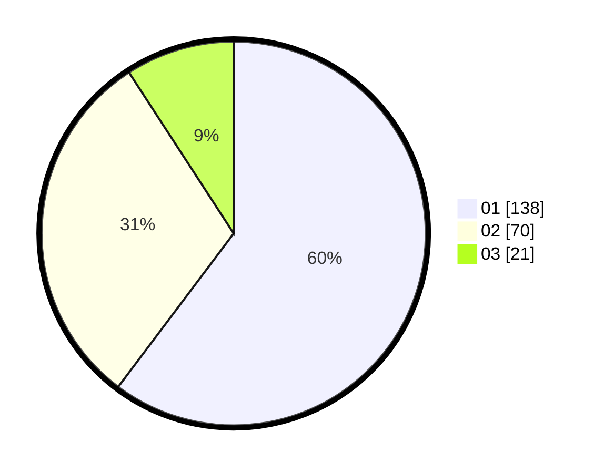

# Hasil

Hasil perolehan suara paslon dapat dilihat pada file paslon-01.txt, paslon-02.txt, dan paslon-03.txt.

Jika tidak ada, artinya data tersebut belum ada pada SIREKAP.

## Perolehan Suara

 * Paslon 01: **138**.
 * Paslon 02: **70**.
 * Paslon 03: **21**.

## Foto C Plano

https://sirekap-obj-formc.kpu.go.id/053a/pemilu/ppwp/31/71/08/10/01/3171081001121-20240216-132026--1fade62d-e7fc-4ea1-82b2-b93d0d99676b.jpg

https://sirekap-obj-formc.kpu.go.id/053a/pemilu/ppwp/31/71/08/10/01/3171081001121-20240216-132027--96b6acd4-c0fb-4fd3-a201-ac388253c4dc.jpg

https://sirekap-obj-formc.kpu.go.id/053a/pemilu/ppwp/31/71/08/10/01/3171081001121-20240216-132027--fb0492aa-b300-4973-b5e3-691c8a39210d.jpg

## DATA PEMILIH TETAP

Jumlah pemilih dalam DPT: **266**.
 * L: **125**.
 * P: **141**.

## DATA PENGGUNA HAK PILIH

Jumlah pengguna hak pilih dalam DPT: **216**.
 * L: **99**.
 * P: **117**.

Jumlah pengguna hak pilih dalam DPTb: **2**.
 * L: **2**.
 * P: **0**.

Jumlah pengguna hak pilih dalam DPK: **15**.
 * L: **5**.
 * P: **10**.

Jumlah pengguna hak pilih: **233**.
 * L: **106**.
 * P: **127**.

## JUMLAH SUARA SAH DAN TIDAK SAH

JUMLAH SELURUH SUARA SAH: **229**.

JUMLAH SUARA TIDAK SAH: **4**.

JUMLAH SELURUH SUARA SAH DAN SUARA TIDAK SAH: **233**.
