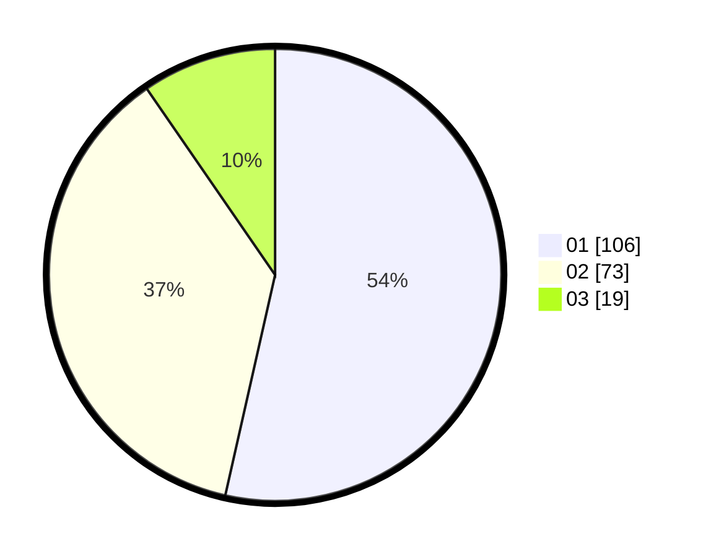

# Hasil

Hasil perolehan suara paslon dapat dilihat pada file paslon-01.txt, paslon-02.txt, dan paslon-03.txt.

Jika tidak ada, artinya data tersebut belum ada pada SIREKAP.

## Perolehan Suara

 * Paslon 01: **106**.
 * Paslon 02: **73**.
 * Paslon 03: **19**.

## Foto C Plano

https://sirekap-obj-formc.kpu.go.id/4dbb/pemilu/ppwp/31/71/08/10/01/3171081001122-20240216-155743--f73747df-dc5a-46e6-930c-8b2e4cd413e2.jpg

https://sirekap-obj-formc.kpu.go.id/4dbb/pemilu/ppwp/31/71/08/10/01/3171081001122-20240214-213129--fa896693-cb39-49b2-a493-13845cb87cdb.jpg

https://sirekap-obj-formc.kpu.go.id/4dbb/pemilu/ppwp/31/71/08/10/01/3171081001122-20240216-155743--c696fd37-c7fc-4d74-a50a-0b97c6ff4486.jpg

## DATA PEMILIH TETAP

Jumlah pemilih dalam DPT: **254**.
 * L: **117**.
 * P: **137**.

## DATA PENGGUNA HAK PILIH

Jumlah pengguna hak pilih dalam DPT: **199**.
 * L: **86**.
 * P: **111**.

Jumlah pengguna hak pilih dalam DPTb: **1**.
 * L: **0**.
 * P: **1**.

Jumlah pengguna hak pilih dalam DPK: **8**.
 * L: **3**.
 * P: **5**.

Jumlah pengguna hak pilih: **199**.
 * L: **89**.
 * P: **110**.

## JUMLAH SUARA SAH DAN TIDAK SAH

JUMLAH SELURUH SUARA SAH: **198**.

JUMLAH SUARA TIDAK SAH: **1**.

JUMLAH SELURUH SUARA SAH DAN SUARA TIDAK SAH: **199**.
