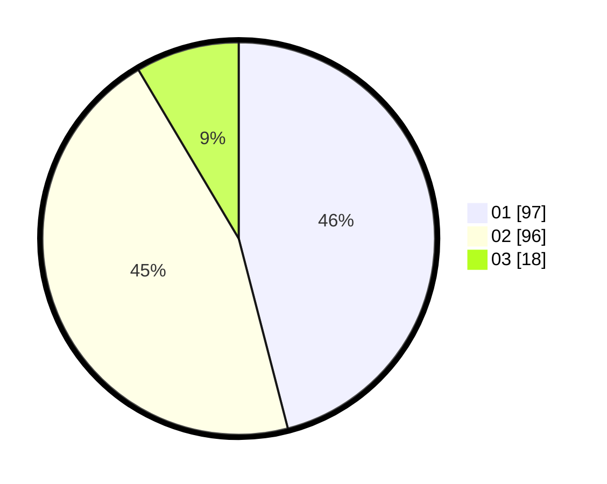

# Hasil

Hasil perolehan suara paslon dapat dilihat pada file paslon-01.txt, paslon-02.txt, dan paslon-03.txt.

Jika tidak ada, artinya data tersebut belum ada pada SIREKAP.

## Perolehan Suara

 * Paslon 01: **97**.
 * Paslon 02: **96**.
 * Paslon 03: **18**.

## Foto C Plano

https://sirekap-obj-formc.kpu.go.id/4b3e/pemilu/ppwp/31/71/08/10/01/3171081001124-20240216-152918--5f989629-7d54-4185-838f-49811738843b.jpg

https://sirekap-obj-formc.kpu.go.id/4b3e/pemilu/ppwp/31/71/08/10/01/3171081001124-20240216-152919--bdf0edbd-cc68-464a-a4a6-88853ed612a5.jpg

https://sirekap-obj-formc.kpu.go.id/4b3e/pemilu/ppwp/31/71/08/10/01/3171081001124-20240216-152919--bdb69124-2d0c-45c1-a6c5-f506eea0043a.jpg

## DATA PEMILIH TETAP

Jumlah pemilih dalam DPT: **205**.
 * L: **93**.
 * P: **112**.

## DATA PENGGUNA HAK PILIH

Jumlah pengguna hak pilih dalam DPT: **205**.
 * L: **93**.
 * P: **112**.

Jumlah pengguna hak pilih dalam DPTb: **4**.
 * L: **2**.
 * P: **2**.

Jumlah pengguna hak pilih dalam DPK: **4**.
 * L: **2**.
 * P: **2**.

Jumlah pengguna hak pilih: **213**.
 * L: **97**.
 * P: **116**.

## JUMLAH SUARA SAH DAN TIDAK SAH

JUMLAH SELURUH SUARA SAH: **211**.

JUMLAH SUARA TIDAK SAH: **2**.

JUMLAH SELURUH SUARA SAH DAN SUARA TIDAK SAH: **213**.
