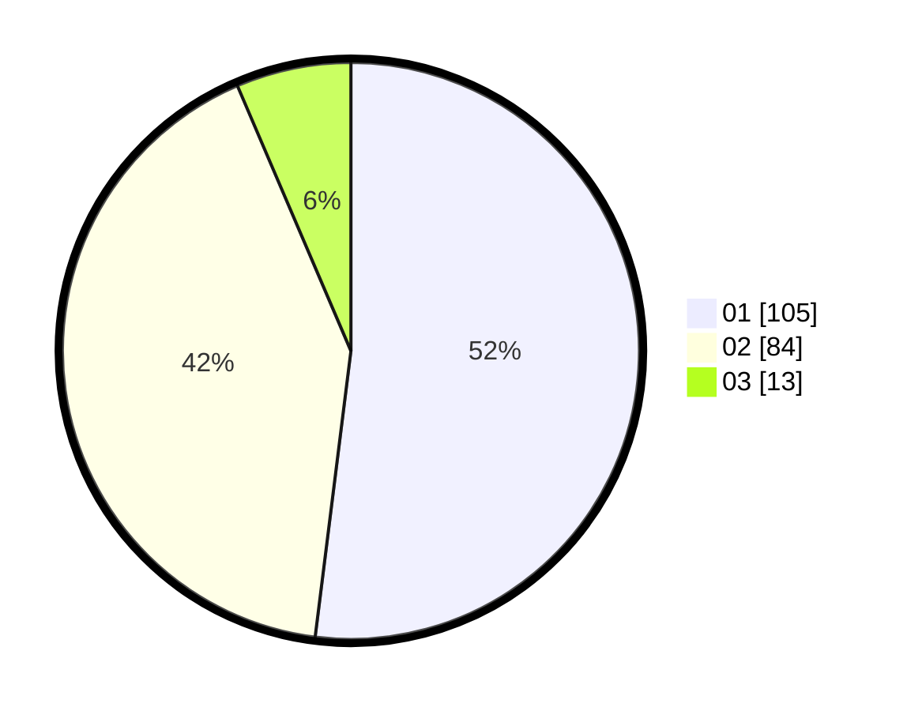

# Hasil

Hasil perolehan suara paslon dapat dilihat pada file paslon-01.txt, paslon-02.txt, dan paslon-03.txt.

Jika tidak ada, artinya data tersebut belum ada pada SIREKAP.

## Perolehan Suara

 * Paslon 01: **105**.
 * Paslon 02: **84**.
 * Paslon 03: **13**.

## Foto C Plano

https://sirekap-obj-formc.kpu.go.id/726c/pemilu/ppwp/31/71/08/10/01/3171081001126-20240216-151748--3dfb6520-0e27-4de9-8116-aa7e313f9d60.jpg

https://sirekap-obj-formc.kpu.go.id/726c/pemilu/ppwp/31/71/08/10/01/3171081001126-20240216-151749--0a9f15ad-46d8-4f07-a315-e2b785a20e95.jpg

https://sirekap-obj-formc.kpu.go.id/726c/pemilu/ppwp/31/71/08/10/01/3171081001126-20240216-151748--e37ec3e2-44d6-4929-ab38-7840776c1578.jpg

## DATA PEMILIH TETAP

Jumlah pemilih dalam DPT: **249**.
 * L: **118**.
 * P: **131**.

## DATA PENGGUNA HAK PILIH

Jumlah pengguna hak pilih dalam DPT: **204**.
 * L: **92**.
 * P: **112**.

Jumlah pengguna hak pilih dalam DPTb: **1**.
 * L: **0**.
 * P: **1**.

Jumlah pengguna hak pilih dalam DPK: **1**.
 * L: **0**.
 * P: **1**.

Jumlah pengguna hak pilih: **206**.
 * L: **92**.
 * P: **114**.

## JUMLAH SUARA SAH DAN TIDAK SAH

JUMLAH SELURUH SUARA SAH: **202**.

JUMLAH SUARA TIDAK SAH: **4**.

JUMLAH SELURUH SUARA SAH DAN SUARA TIDAK SAH: **206**.
