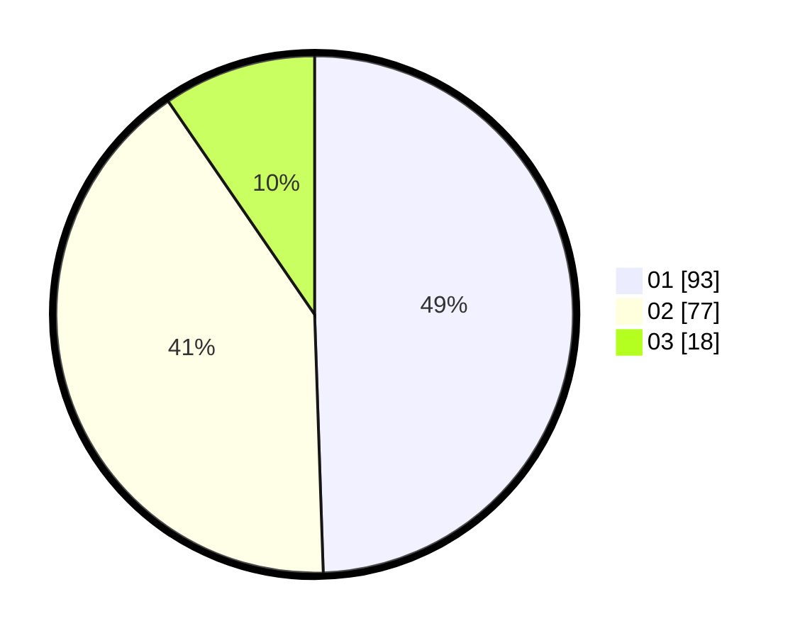

# Hasil

Hasil perolehan suara paslon dapat dilihat pada file paslon-01.txt, paslon-02.txt, dan paslon-03.txt.

Jika tidak ada, artinya data tersebut belum ada pada SIREKAP.

## Perolehan Suara

 * Paslon 01: **93**.
 * Paslon 02: **77**.
 * Paslon 03: **18**.

## Foto C Plano

https://sirekap-obj-formc.kpu.go.id/3031/pemilu/ppwp/31/71/08/10/01/3171081001127-20240215-092612--979e2ba5-ddad-4fc4-9b4d-dd51a3ccb394.jpg

https://sirekap-obj-formc.kpu.go.id/3031/pemilu/ppwp/31/71/08/10/01/3171081001127-20240215-092803--3569ea7c-e8f8-4733-a06b-c3b9db3652e5.jpg

https://sirekap-obj-formc.kpu.go.id/3031/pemilu/ppwp/31/71/08/10/01/3171081001127-20240215-093007--9af5a6db-38d5-4844-860e-e46976c56f94.jpg

## DATA PEMILIH TETAP

Jumlah pemilih dalam DPT: **268**.
 * L: **128**.
 * P: **140**.

## DATA PENGGUNA HAK PILIH

Jumlah pengguna hak pilih dalam DPT: **188**.
 * L: **87**.
 * P: **101**.

Jumlah pengguna hak pilih dalam DPTb: **1**.
 * L: **0**.
 * P: **1**.

Jumlah pengguna hak pilih dalam DPK: **3**.
 * L: **1**.
 * P: **2**.

Jumlah pengguna hak pilih: **192**.
 * L: **88**.
 * P: **104**.

## JUMLAH SUARA SAH DAN TIDAK SAH

JUMLAH SELURUH SUARA SAH: **188**.

JUMLAH SUARA TIDAK SAH: **4**.

JUMLAH SELURUH SUARA SAH DAN SUARA TIDAK SAH: **192**.
