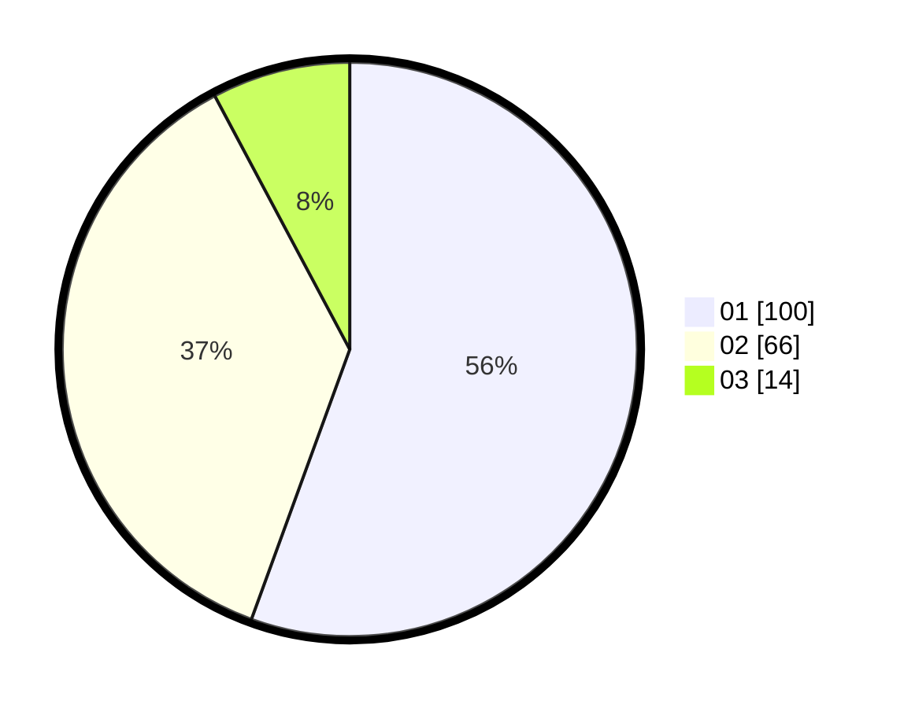

# Hasil

Hasil perolehan suara paslon dapat dilihat pada file paslon-01.txt, paslon-02.txt, dan paslon-03.txt.

Jika tidak ada, artinya data tersebut belum ada pada SIREKAP.

## Perolehan Suara

 * Paslon 01: **100**.
 * Paslon 02: **66**.
 * Paslon 03: **14**.

## Foto C Plano

https://sirekap-obj-formc.kpu.go.id/fcf2/pemilu/ppwp/31/71/08/10/01/3171081001128-20240216-151719--bb442a62-737f-4f16-87d1-81c159a9352f.jpg

https://sirekap-obj-formc.kpu.go.id/fcf2/pemilu/ppwp/31/71/08/10/01/3171081001128-20240216-151721--7939fb4e-d21a-40c9-9426-5474fa5606a5.jpg

https://sirekap-obj-formc.kpu.go.id/fcf2/pemilu/ppwp/31/71/08/10/01/3171081001128-20240216-151720--6d759336-abc9-471d-94be-ecbba7d34ac1.jpg

## DATA PEMILIH TETAP

Jumlah pemilih dalam DPT: **238**.
 * L: **125**.
 * P: **113**.

## DATA PENGGUNA HAK PILIH

Jumlah pengguna hak pilih dalam DPT: **180**.
 * L: **90**.
 * P: **90**.

Jumlah pengguna hak pilih dalam DPTb: **0**.
 * L: **0**.
 * P: **0**.

Jumlah pengguna hak pilih dalam DPK: **3**.
 * L: **0**.
 * P: **3**.

Jumlah pengguna hak pilih: **183**.
 * L: **90**.
 * P: **93**.

## JUMLAH SUARA SAH DAN TIDAK SAH

JUMLAH SELURUH SUARA SAH: **180**.

JUMLAH SUARA TIDAK SAH: **3**.

JUMLAH SELURUH SUARA SAH DAN SUARA TIDAK SAH: **183**.
