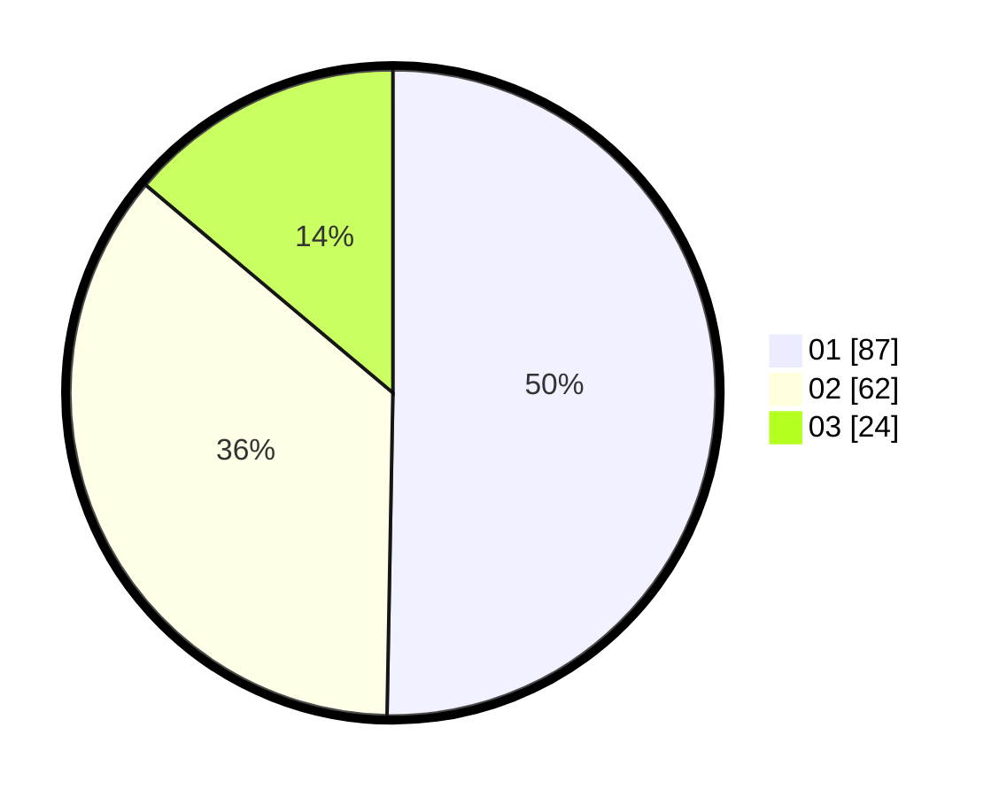

# Hasil

Hasil perolehan suara paslon dapat dilihat pada file paslon-01.txt, paslon-02.txt, dan paslon-03.txt.

Jika tidak ada, artinya data tersebut belum ada pada SIREKAP.

## Perolehan Suara

 * Paslon 01: **87**.
 * Paslon 02: **62**.
 * Paslon 03: **24**.

## Foto C Plano

https://sirekap-obj-formc.kpu.go.id/5445/pemilu/ppwp/31/71/08/10/01/3171081001129-20240216-155028--e788b46e-9b5d-4f0a-83d8-8ffe8c8bf3fa.jpg

https://sirekap-obj-formc.kpu.go.id/5445/pemilu/ppwp/31/71/08/10/01/3171081001129-20240216-155029--f05844c0-49af-4bdb-9dea-f0c987c994f3.jpg

https://sirekap-obj-formc.kpu.go.id/5445/pemilu/ppwp/31/71/08/10/01/3171081001129-20240216-155029--d0e4ca36-b2cc-489e-a045-9aa866ebd92c.jpg

## DATA PEMILIH TETAP

Jumlah pemilih dalam DPT: **238**.
 * L: **106**.
 * P: **132**.

## DATA PENGGUNA HAK PILIH

Jumlah pengguna hak pilih dalam DPT: **172**.
 * L: **73**.
 * P: **99**.

Jumlah pengguna hak pilih dalam DPTb: **6**.
 * L: **1**.
 * P: **5**.

Jumlah pengguna hak pilih dalam DPK: **1**.
 * L: **1**.
 * P: **0**.

Jumlah pengguna hak pilih: **179**.
 * L: **75**.
 * P: **104**.

## JUMLAH SUARA SAH DAN TIDAK SAH

JUMLAH SELURUH SUARA SAH: **173**.

JUMLAH SUARA TIDAK SAH: **6**.

JUMLAH SELURUH SUARA SAH DAN SUARA TIDAK SAH: **179**.
