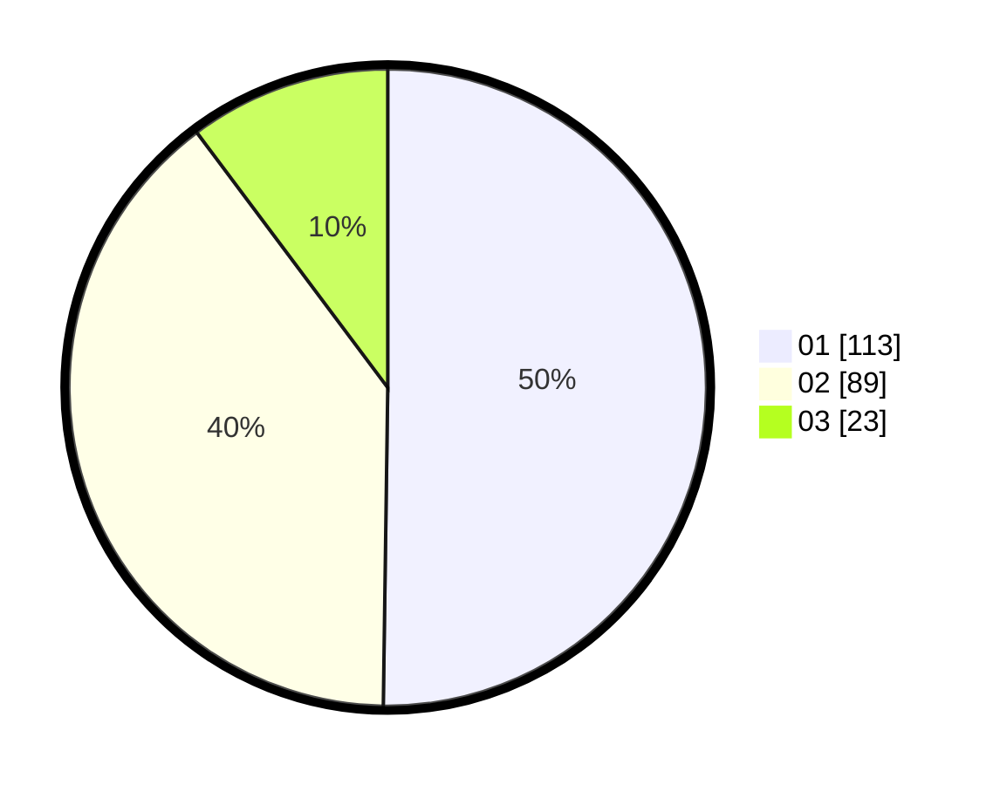

# Hasil

Hasil perolehan suara paslon dapat dilihat pada file paslon-01.txt, paslon-02.txt, dan paslon-03.txt.

Jika tidak ada, artinya data tersebut belum ada pada SIREKAP.

## Perolehan Suara

 * Paslon 01: **113**.
 * Paslon 02: **89**.
 * Paslon 03: **23**.

## Foto C Plano

https://sirekap-obj-formc.kpu.go.id/dba4/pemilu/ppwp/31/71/08/10/02/3171081002002-20240215-235533--12d7d393-0a41-4c9c-96e4-e48a0e7b351b.jpg

https://sirekap-obj-formc.kpu.go.id/dba4/pemilu/ppwp/31/71/08/10/02/3171081002002-20240215-235538--d8972ab6-1a22-423e-9699-3aee867d3868.jpg

https://sirekap-obj-formc.kpu.go.id/dba4/pemilu/ppwp/31/71/08/10/02/3171081002002-20240215-235536--d2c48fd2-3e38-40e1-9ec6-e8a23571f142.jpg

## DATA PEMILIH TETAP

Jumlah pemilih dalam DPT: **275**.
 * L: **135**.
 * P: **140**.

## DATA PENGGUNA HAK PILIH

Jumlah pengguna hak pilih dalam DPT: **222**.
 * L: **106**.
 * P: **116**.

Jumlah pengguna hak pilih dalam DPTb: **4**.
 * L: **1**.
 * P: **3**.

Jumlah pengguna hak pilih dalam DPK: **1**.
 * L: **0**.
 * P: **1**.

Jumlah pengguna hak pilih: **227**.
 * L: **107**.
 * P: **120**.

## JUMLAH SUARA SAH DAN TIDAK SAH

JUMLAH SELURUH SUARA SAH: **225**.

JUMLAH SUARA TIDAK SAH: **2**.

JUMLAH SELURUH SUARA SAH DAN SUARA TIDAK SAH: **227**.
