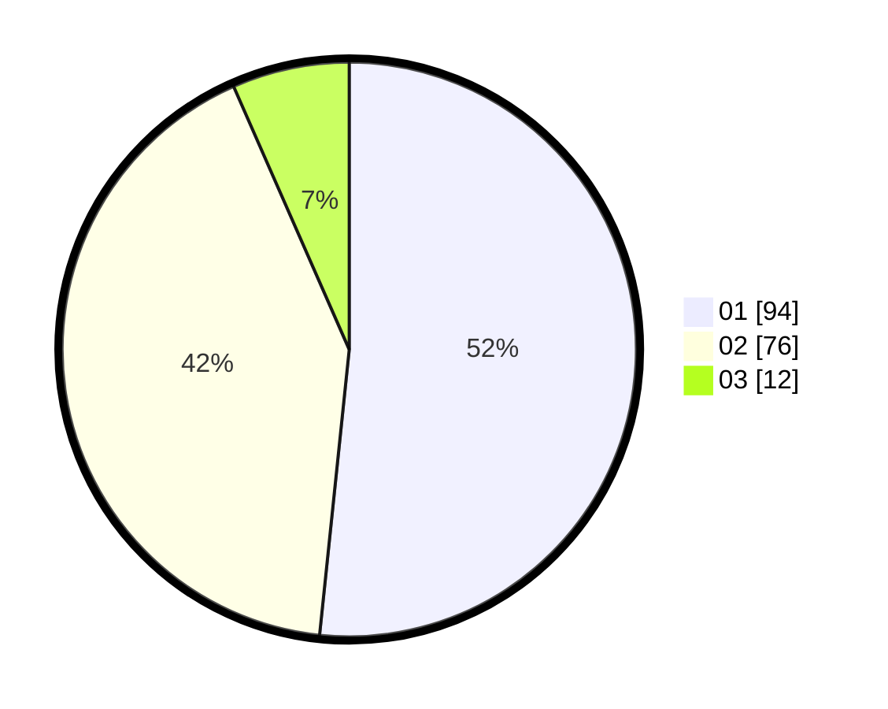

# Hasil

Hasil perolehan suara paslon dapat dilihat pada file paslon-01.txt, paslon-02.txt, dan paslon-03.txt.

Jika tidak ada, artinya data tersebut belum ada pada SIREKAP.

## Perolehan Suara

 * Paslon 01: **94**.
 * Paslon 02: **76**.
 * Paslon 03: **12**.

## Foto C Plano

https://sirekap-obj-formc.kpu.go.id/eb7b/pemilu/ppwp/31/71/08/10/02/3171081002008-20240216-141824--c2119716-5719-4442-a127-6ee9ab4fc03f.jpg

https://sirekap-obj-formc.kpu.go.id/eb7b/pemilu/ppwp/31/71/08/10/02/3171081002008-20240216-141826--4a2e3bb7-729f-4927-bf3f-362996c002a1.jpg

https://sirekap-obj-formc.kpu.go.id/eb7b/pemilu/ppwp/31/71/08/10/02/3171081002008-20240216-141825--1be64474-0e35-4ac3-8fde-8276fce011ec.jpg

## DATA PEMILIH TETAP

Jumlah pemilih dalam DPT: **268**.
 * L: **132**.
 * P: **136**.

## DATA PENGGUNA HAK PILIH

Jumlah pengguna hak pilih dalam DPT: **181**.
 * L: **88**.
 * P: **93**.

Jumlah pengguna hak pilih dalam DPTb: **3**.
 * L: **2**.
 * P: **1**.

Jumlah pengguna hak pilih dalam DPK: **2**.
 * L: **1**.
 * P: **1**.

Jumlah pengguna hak pilih: **186**.
 * L: **91**.
 * P: **95**.

## JUMLAH SUARA SAH DAN TIDAK SAH

JUMLAH SELURUH SUARA SAH: **182**.

JUMLAH SUARA TIDAK SAH: **4**.

JUMLAH SELURUH SUARA SAH DAN SUARA TIDAK SAH: **186**.
