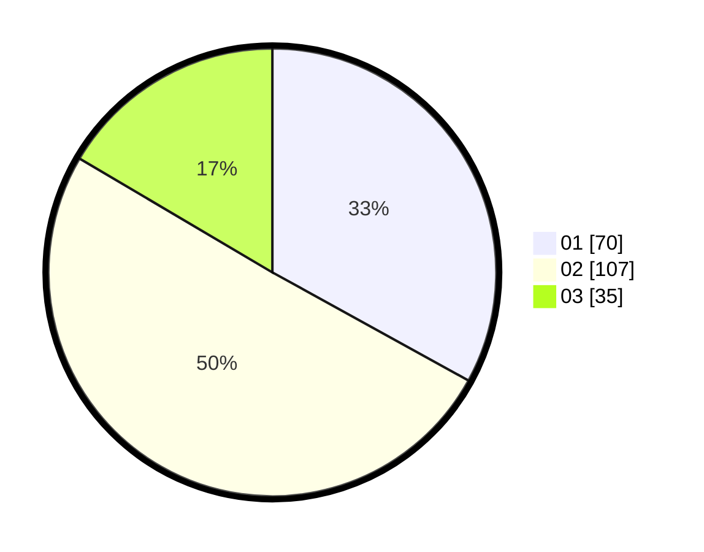

# Hasil

Hasil perolehan suara paslon dapat dilihat pada file paslon-01.txt, paslon-02.txt, dan paslon-03.txt.

Jika tidak ada, artinya data tersebut belum ada pada SIREKAP.

## Perolehan Suara

 * Paslon 01: **70**.
 * Paslon 02: **107**.
 * Paslon 03: **35**.

## Foto C Plano

https://sirekap-obj-formc.kpu.go.id/224d/pemilu/ppwp/31/71/08/10/02/3171081002009-20240217-194426--2ae0f263-c11f-46d0-9381-0d871deffff2.jpg

https://sirekap-obj-formc.kpu.go.id/224d/pemilu/ppwp/31/71/08/10/02/3171081002009-20240217-194427--40254b15-7ddd-4764-bd18-31317941b8ed.jpg

https://sirekap-obj-formc.kpu.go.id/224d/pemilu/ppwp/31/71/08/10/02/3171081002009-20240217-194427--9f9156c3-b4c2-43fc-bf0a-2b2386835cd3.jpg

## DATA PEMILIH TETAP

Jumlah pemilih dalam DPT: **0**.
 * L: **0**.
 * P: **0**.

## DATA PENGGUNA HAK PILIH

Jumlah pengguna hak pilih dalam DPT: **0**.
 * L: **0**.
 * P: **0**.

Jumlah pengguna hak pilih dalam DPTb: **0**.
 * L: **0**.
 * P: **0**.

Jumlah pengguna hak pilih dalam DPK: **0**.
 * L: **0**.
 * P: **0**.

Jumlah pengguna hak pilih: **0**.
 * L: **0**.
 * P: **0**.

## JUMLAH SUARA SAH DAN TIDAK SAH

JUMLAH SELURUH SUARA SAH: **212**.

JUMLAH SUARA TIDAK SAH: **10**.

JUMLAH SELURUH SUARA SAH DAN SUARA TIDAK SAH: **222**.
