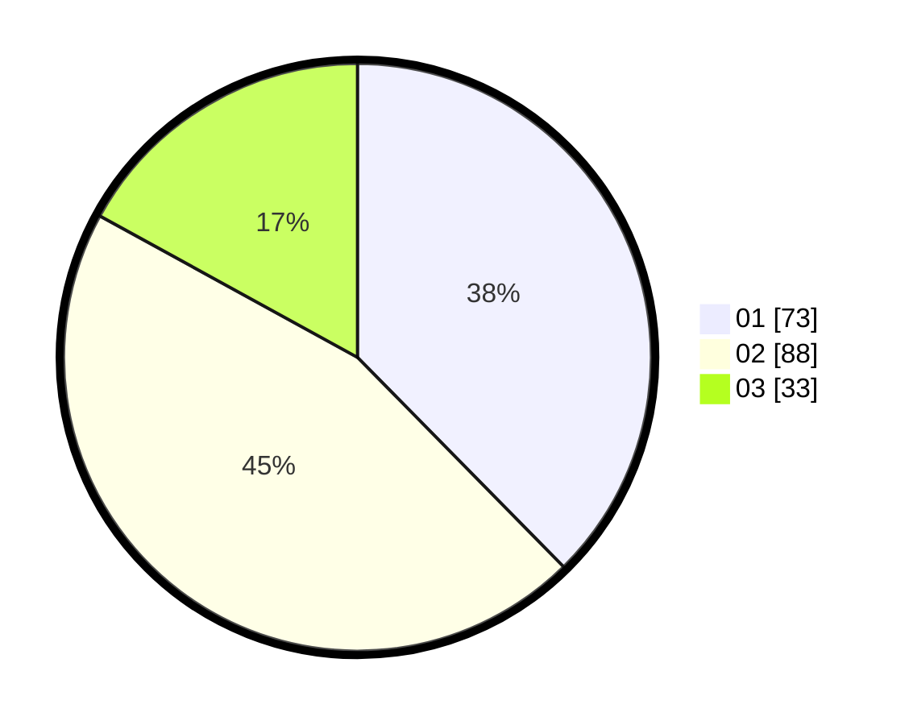

# Hasil

Hasil perolehan suara paslon dapat dilihat pada file paslon-01.txt, paslon-02.txt, dan paslon-03.txt.

Jika tidak ada, artinya data tersebut belum ada pada SIREKAP.

## Perolehan Suara

 * Paslon 01: **73**.
 * Paslon 02: **88**.
 * Paslon 03: **33**.

## Foto C Plano

https://sirekap-obj-formc.kpu.go.id/1545/pemilu/ppwp/31/71/08/10/02/3171081002010-20240215-024115--839d3dba-5f2f-41f1-87e0-fbf8e9cdeaa0.jpg

https://sirekap-obj-formc.kpu.go.id/1545/pemilu/ppwp/31/71/08/10/02/3171081002010-20240215-024337--d3418409-6f04-460f-abf8-b40637bad2d4.jpg
