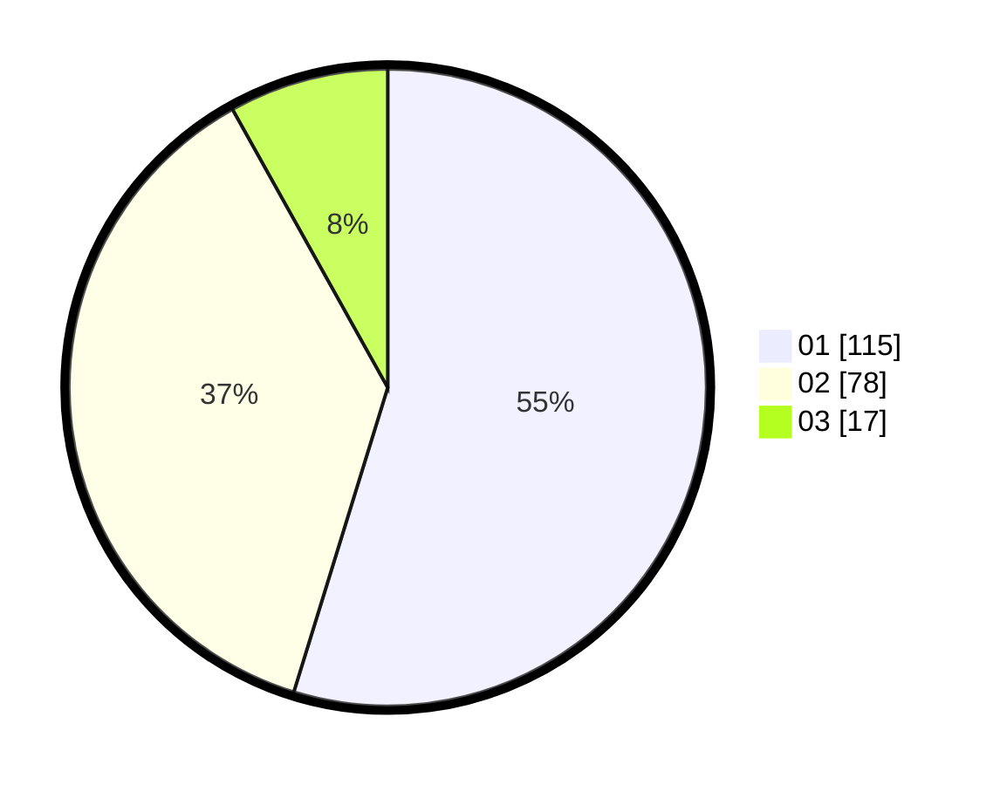

# Hasil

Hasil perolehan suara paslon dapat dilihat pada file paslon-01.txt, paslon-02.txt, dan paslon-03.txt.

Jika tidak ada, artinya data tersebut belum ada pada SIREKAP.

## Perolehan Suara

 * Paslon 01: **115**.
 * Paslon 02: **78**.
 * Paslon 03: **17**.

## Foto C Plano

https://sirekap-obj-formc.kpu.go.id/8690/pemilu/ppwp/31/71/08/10/02/3171081002011-20240216-135951--2cb9a7d8-9821-4899-bf16-6b5697836dab.jpg

https://sirekap-obj-formc.kpu.go.id/8690/pemilu/ppwp/31/71/08/10/02/3171081002011-20240216-140422--497779dd-ba4f-4338-92fc-300c5e5a7756.jpg

https://sirekap-obj-formc.kpu.go.id/8690/pemilu/ppwp/31/71/08/10/02/3171081002011-20240216-140546--6fb62700-60d0-40c9-97ef-f9a3df7d734d.jpg

## DATA PEMILIH TETAP

Jumlah pemilih dalam DPT: **268**.
 * L: **132**.
 * P: **136**.

## DATA PENGGUNA HAK PILIH

Jumlah pengguna hak pilih dalam DPT: **209**.
 * L: **96**.
 * P: **113**.

Jumlah pengguna hak pilih dalam DPTb: **2**.
 * L: **1**.
 * P: **1**.

Jumlah pengguna hak pilih dalam DPK: **2**.
 * L: **1**.
 * P: **1**.

Jumlah pengguna hak pilih: **213**.
 * L: **98**.
 * P: **115**.

## JUMLAH SUARA SAH DAN TIDAK SAH

JUMLAH SELURUH SUARA SAH: **210**.

JUMLAH SUARA TIDAK SAH: **3**.

JUMLAH SELURUH SUARA SAH DAN SUARA TIDAK SAH: **213**.
