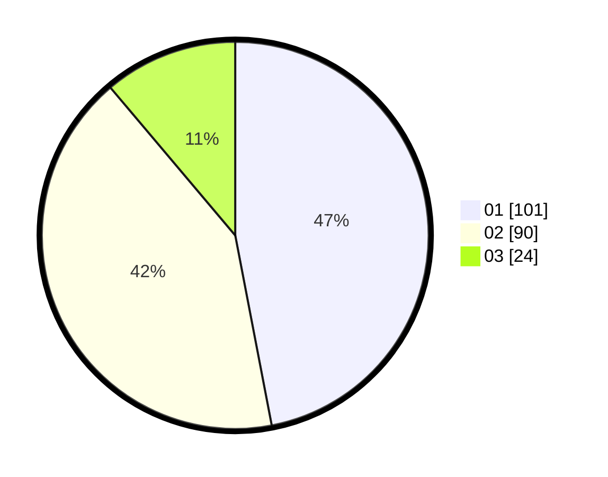

# Hasil

Hasil perolehan suara paslon dapat dilihat pada file paslon-01.txt, paslon-02.txt, dan paslon-03.txt.

Jika tidak ada, artinya data tersebut belum ada pada SIREKAP.

## Perolehan Suara

 * Paslon 01: **101**.
 * Paslon 02: **90**.
 * Paslon 03: **24**.

## Foto C Plano

https://sirekap-obj-formc.kpu.go.id/dfaf/pemilu/ppwp/31/71/08/10/02/3171081002016-20240218-203619--97d04b23-39ef-4543-b699-058cea434113.jpg

https://sirekap-obj-formc.kpu.go.id/dfaf/pemilu/ppwp/31/71/08/10/02/3171081002016-20240218-203939--55216a45-47ae-4db4-a5f0-9e6f529d1b6e.jpg

https://sirekap-obj-formc.kpu.go.id/dfaf/pemilu/ppwp/31/71/08/10/02/3171081002016-20240219-110532--9e0820e0-c12f-4159-9ffc-e7082ba1b8cc.jpg

## DATA PEMILIH TETAP

Jumlah pemilih dalam DPT: **212**.
 * L: **99**.
 * P: **113**.

## DATA PENGGUNA HAK PILIH

Jumlah pengguna hak pilih dalam DPT: **212**.
 * L: **99**.
 * P: **113**.

Jumlah pengguna hak pilih dalam DPTb: **2**.
 * L: **1**.
 * P: **1**.

Jumlah pengguna hak pilih dalam DPK: **2**.
 * L: **1**.
 * P: **1**.

Jumlah pengguna hak pilih: **216**.
 * L: **101**.
 * P: **115**.

## JUMLAH SUARA SAH DAN TIDAK SAH

JUMLAH SELURUH SUARA SAH: **215**.

JUMLAH SUARA TIDAK SAH: **1**.

JUMLAH SELURUH SUARA SAH DAN SUARA TIDAK SAH: **216**.
