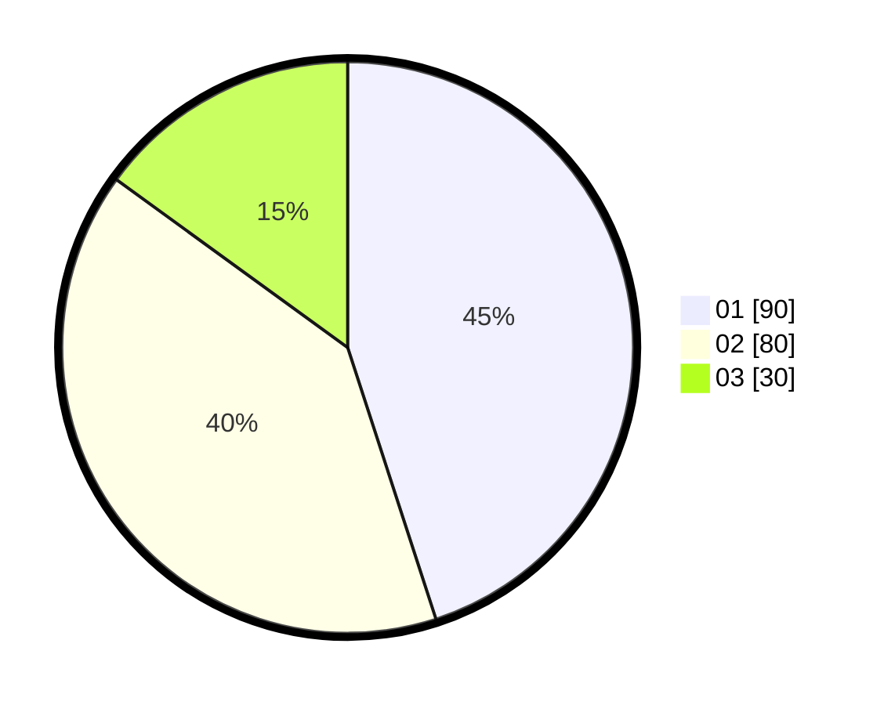

# Hasil

Hasil perolehan suara paslon dapat dilihat pada file paslon-01.txt, paslon-02.txt, dan paslon-03.txt.

Jika tidak ada, artinya data tersebut belum ada pada SIREKAP.

## Perolehan Suara

 * Paslon 01: **90**.
 * Paslon 02: **80**.
 * Paslon 03: **30**.

## Foto C Plano

https://sirekap-obj-formc.kpu.go.id/e5a0/pemilu/ppwp/31/71/08/10/02/3171081002019-20240218-093842--ca98f87f-7c8c-4b40-8b42-2b446ae560f3.jpg

https://sirekap-obj-formc.kpu.go.id/e5a0/pemilu/ppwp/31/71/08/10/02/3171081002019-20240218-093926--a56f80a7-b7bc-4a8c-915c-dd92b37aded2.jpg

https://sirekap-obj-formc.kpu.go.id/e5a0/pemilu/ppwp/31/71/08/10/02/3171081002019-20240214-234008--5549a77d-5dce-4453-b37f-7aa3e079f454.jpg
