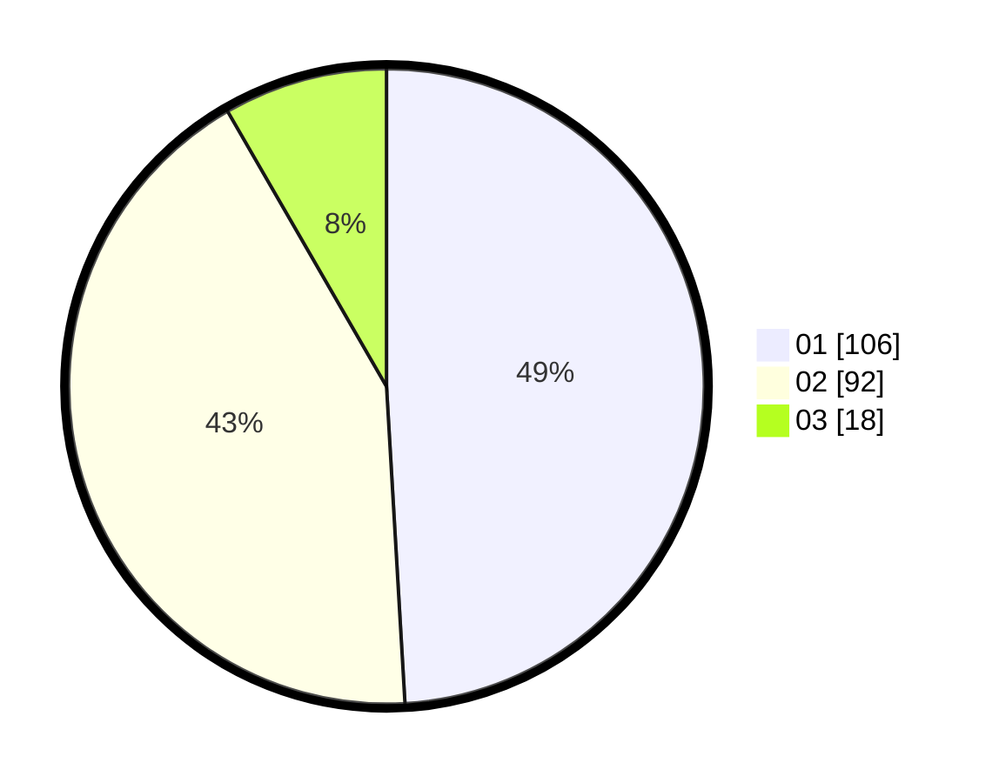

# Hasil

Hasil perolehan suara paslon dapat dilihat pada file paslon-01.txt, paslon-02.txt, dan paslon-03.txt.

Jika tidak ada, artinya data tersebut belum ada pada SIREKAP.

## Perolehan Suara

 * Paslon 01: **106**.
 * Paslon 02: **92**.
 * Paslon 03: **18**.

## Foto C Plano

https://sirekap-obj-formc.kpu.go.id/febf/pemilu/ppwp/31/71/08/10/02/3171081002023-20240217-182902--cd2b461a-becb-4892-a1a8-db75042628da.jpg

https://sirekap-obj-formc.kpu.go.id/febf/pemilu/ppwp/31/71/08/10/02/3171081002023-20240217-182903--bfb21fd7-e266-4c52-9306-f1094f3cf530.jpg

https://sirekap-obj-formc.kpu.go.id/febf/pemilu/ppwp/31/71/08/10/02/3171081002023-20240217-182903--4108c775-4923-49b7-9f9d-1c911dc55b11.jpg

## DATA PEMILIH TETAP

Jumlah pemilih dalam DPT: **269**.
 * L: **137**.
 * P: **132**.

## DATA PENGGUNA HAK PILIH

Jumlah pengguna hak pilih dalam DPT: **211**.
 * L: **103**.
 * P: **108**.

Jumlah pengguna hak pilih dalam DPTb: **1**.
 * L: **0**.
 * P: **1**.

Jumlah pengguna hak pilih dalam DPK: **7**.
 * L: **2**.
 * P: **5**.

Jumlah pengguna hak pilih: **219**.
 * L: **105**.
 * P: **114**.

## JUMLAH SUARA SAH DAN TIDAK SAH

JUMLAH SELURUH SUARA SAH: **0**.

JUMLAH SUARA TIDAK SAH: **0**.

JUMLAH SELURUH SUARA SAH DAN SUARA TIDAK SAH: **0**.
